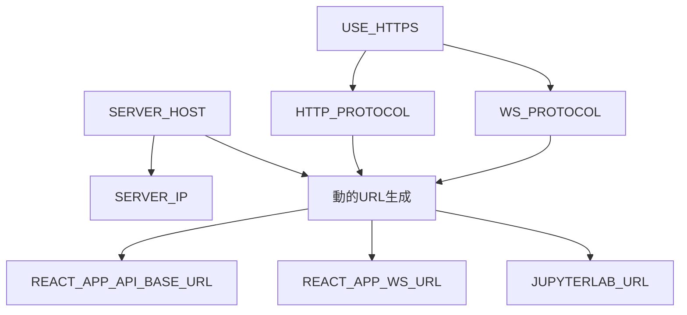

# 🚀 環境切り替えガイド

## 概要

JupyterLab Cell Monitor Extensionプロジェクトの環境設定を**1行のコマンド**で切り替えることができるベストプラクティス実装です。

## ✨ 主な特徴

- **🎯 1行での環境切り替え**: `./scripts/setup-env.sh development` または `./scripts/setup-env.sh set-server 192.168.1.100`
- **🔄 動的URL生成**: `SERVER_HOST`変数1つの変更で全URLが自動更新
- **🛡️ 自動バックアップ**: 環境切り替え時に既存の`.env`を自動バックアップ
- **📋 環境別プリセット**: 開発環境・本番環境の最適化設定
- **🔐 セキュリティ考慮**: 本番環境用のセキュリティ設定テンプレート

## 📁 ファイル構成

```
├── .env                        # 現在使用中の環境設定
├── .env.example.improved       # 改善版テンプレート（参考用）
├── .env.development           # 開発環境プリセット
├── .env.production            # 本番環境プリセット
├── scripts/
│   └── setup-env.sh          # 環境切り替えスクリプト
└── .env-backups/             # 自動バックアップディレクトリ
```

## 🔧 使用方法

### 1. 開発環境への切り替え

```bash
# ローカル開発環境（localhost）に切り替え
./scripts/setup-env.sh development
```

自動設定される内容：
- `SERVER_HOST=localhost`
- Docker内部通信用コンテナ名
- デバッグモード有効
- 開発用ログレベル

### 2. 本番環境への切り替え

#### 方法1: IPアドレス指定（推奨）

```bash
# サーバーIP 192.168.1.100 で本番環境を自動設定
./scripts/setup-env.sh set-server 192.168.1.100
```

#### 方法2: テンプレート使用

```bash
# 本番環境テンプレートに切り替え（手動でIP設定が必要）
./scripts/setup-env.sh production
```

### 3. 環境状態の確認

```bash
# 現在の環境設定とDocker状態を確認
./scripts/setup-env.sh status
```

### 4. バックアップ作成

```bash
# 現在の.envファイルを手動バックアップ
./scripts/setup-env.sh backup
```

## 🌐 動的URL生成の仕組み

### 中央管理変数
```bash
# .envファイルの設定例
SERVER_HOST=192.168.1.100
SERVER_IP=${SERVER_HOST}
USE_HTTPS=false
HTTP_PROTOCOL=${USE_HTTPS:+https:}${USE_HTTPS:-http:}
WS_PROTOCOL=${USE_HTTPS:+wss:}${USE_HTTPS:-ws:}
```

### 自動生成されるURL
```bash
# 以下のURLが自動的に生成される
REACT_APP_API_BASE_URL=${HTTP_PROTOCOL}//${SERVER_IP}:${FASTAPI_PORT}/api/v1
REACT_APP_WS_URL=${WS_PROTOCOL}//${SERVER_IP}:${FASTAPI_PORT}
JUPYTERLAB_URL=${HTTP_PROTOCOL}//${SERVER_IP}:${JUPYTERLAB_PORT}
```

## 📋 環境別設定の詳細

### 開発環境 (.env.development)
- **ホスト**: `localhost`
- **プロトコル**: HTTP
- **ログレベル**: DEBUG
- **CORS**: 寛容な設定
- **Docker通信**: コンテナ名使用

### 本番環境 (.env.production)
- **ホスト**: 設定可能なIPアドレス
- **プロトコル**: HTTP/HTTPS対応
- **ログレベル**: INFO
- **CORS**: 制限的な設定
- **セキュリティ**: 強化設定

## 🔐 セキュリティ設定

本番環境では以下の設定を必ず変更してください：

```bash
# 強力なランダムキーの生成
SECRET_KEY=$(openssl rand -hex 64)
POSTGRES_PASSWORD=$(openssl rand -hex 32)
JUPYTER_TOKEN=$(openssl rand -hex 16)
INFLUXDB_INIT_ADMIN_TOKEN=$(openssl rand -hex 32)

# HTTPS有効化（SSL証明書がある場合）
USE_HTTPS=true
```

## 🚀 デプロイメントワークフロー

### ローカル開発
```bash
# 1. 開発環境に切り替え
./scripts/setup-env.sh development

# 2. サービス起動
docker compose down && docker compose up --build
```

### 本番デプロイ
```bash
# 1. サーバーIPで本番環境設定
./scripts/setup-env.sh set-server 192.168.1.100

# 2. セキュリティ設定の確認・更新
vim .env  # SECRET_KEY, パスワード等を変更

# 3. サービス起動
docker compose down && docker compose up --build -d
```

## 🛠️ トラブルシューティング

### 環境ファイルが見つからない
```bash
# 必要なファイルの存在確認
ls -la .env*
```

### 権限エラー
```bash
# スクリプトに実行権限を付与
chmod +x scripts/setup-env.sh
```

### バックアップ確認
```bash
# バックアップファイルの確認
ls -la .env-backups/
```

## 🔄 環境変数の依存関係



## 💡 ベストプラクティス

1. **環境切り替え前のバックアップ**: スクリプトが自動実行
2. **IP検証**: 不正なIPアドレス形式の警告表示
3. **セキュリティチェック**: 本番環境での必須設定項目リマインド
4. **ログ出力**: カラー付きで分かりやすい進行状況表示
5. **エラー処理**: 適切なエラーメッセージとガイダンス

この環境切り替えシステムにより、開発・本番環境間の移行が安全かつ効率的に行えます。