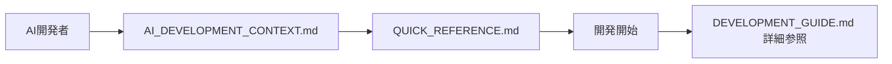
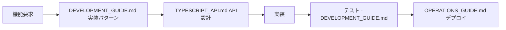
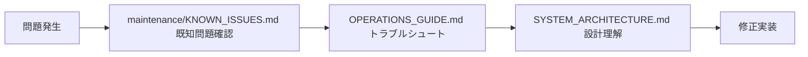

# Documentation Index - Cell Monitor Extension

**最終更新**: 2025-08-24  
**ドキュメントバージョン**: 2.0  
**対象システム**: JupyterLab Cell Monitor Extension v1.1.0

## 📚 ドキュメント全体概要

このディレクトリには、Cell Monitor Extension の包括的なドキュメンテーションが含まれています。AI駆動開発を効率化するため、構造化され、コンテキスト豊富な情報を提供しています。

---

## 🎯 読者別推奨ドキュメント

### 👤 人間開発者
| 経験レベル | 開始ドキュメント | 目的 |
|-----------|-----------------|------|
| **新規参加** | [SETUP.md](./development/SETUP.md) | 開発環境構築 |
| **一般開発** | [DEVELOPMENT_GUIDE.md](./DEVELOPMENT_GUIDE.md) | 包括的開発ガイド |
| **上級者** | [SYSTEM_ARCHITECTURE.md](./architecture/SYSTEM_ARCHITECTURE.md) | システム設計理解 |

### 🤖 AI開発者
| 用途 | ドキュメント | 説明 |
|------|-------------|------|
| **初回コンテキスト** | [AI_DEVELOPMENT_CONTEXT.md](./AI_DEVELOPMENT_CONTEXT.md) | AI開発のための包括的情報 |
| **クイックリファレンス** | [QUICK_REFERENCE.md](./QUICK_REFERENCE.md) | 素早い情報アクセス |
| **品質評価** | [EXTENSION_EVALUATION_REPORT.md](./EXTENSION_EVALUATION_REPORT.md) | システム品質分析 |

### 🔧 運用管理者
| 役割 | ドキュメント | 説明 |
|------|-------------|------|
| **日常運用** | [OPERATIONS_GUIDE.md](./OPERATIONS_GUIDE.md) | 運用・保守・トラブルシューティング |
| **問題対応** | [maintenance/KNOWN_ISSUES.md](./maintenance/KNOWN_ISSUES.md) | 既知問題と修正履歴 |

---

## 📋 ドキュメント分類

### 🚀 クイックスタート・概要
| ファイル | 目的 | 重要度 |
|----------|------|-------|
| **[README.md](./README.md)** | プロジェクト概要とドキュメント構成 | 🔴 必須 |
| **[QUICK_REFERENCE.md](./QUICK_REFERENCE.md)** | 開発者向けクイックリファレンス | 🟡 推奨 |
| **[DOCUMENTATION_INDEX.md](./DOCUMENTATION_INDEX.md)** | このファイル - ドキュメント全体案内 | 🟡 推奨 |

### 🤖 AI開発支援
| ファイル | 目的 | AI適用度 |
|----------|------|---------|
| **[AI_DEVELOPMENT_CONTEXT.md](./AI_DEVELOPMENT_CONTEXT.md)** | AI駆動開発のための包括的コンテキスト | 🟢 最適化済み |
| **[DEVELOPMENT_GUIDE.md](./DEVELOPMENT_GUIDE.md)** | 詳細な開発フローとベストプラクティス | 🟢 最適化済み |

### 🏗️ 技術仕様・アーキテクチャ
| ディレクトリ/ファイル | 内容 | 詳細度 |
|-------------------|------|-------|
| **[architecture/](./architecture/)** | システム設計ドキュメント | 🔵 高 |
| ├── [SYSTEM_ARCHITECTURE.md](./architecture/SYSTEM_ARCHITECTURE.md) | 全体アーキテクチャ設計 | 🔵 高 |
| **[api/](./api/)** | API仕様ドキュメント | 🔵 高 |
| ├── [TYPESCRIPT_API.md](./api/TYPESCRIPT_API.md) | TypeScript API リファレンス | 🔵 高 |

### 🛠️ 開発ガイド
| ディレクトリ/ファイル | 内容 | 対象者 |
|-------------------|------|--------|
| **[development/](./development/)** | 開発関連ドキュメント | 👤 人間開発者 |
| ├── [SETUP.md](./development/SETUP.md) | 開発環境セットアップガイド | 👤 初心者 |

### 🔗 統合・連携
| ディレクトリ/ファイル | 内容 | 専門性 |
|-------------------|------|--------|
| **[integration/](./integration/)** | 外部システム統合 | 🔵 中〜高 |
| ├── [JUPYTERLAB_INTEGRATION.md](./integration/JUPYTERLAB_INTEGRATION.md) | JupyterLab統合方法 | 🔵 中 |

### 📋 運用・管理
| ファイル | 内容 | 緊急度 |
|----------|------|-------|
| **[OPERATIONS_GUIDE.md](./OPERATIONS_GUIDE.md)** | 日常運用・保守ガイド | 🔴 高 |
| **[maintenance/KNOWN_ISSUES.md](./maintenance/KNOWN_ISSUES.md)** | 問題分析・修正履歴 | 🟡 中 |

### 📊 評価・分析
| ファイル | 内容 | 詳細度 |
|----------|------|-------|
| **[EXTENSION_EVALUATION_REPORT.md](./EXTENSION_EVALUATION_REPORT.md)** | 品質評価・多角的分析レポート | 🔵 非常に高 |

---

## 🔄 ドキュメント更新履歴

### v2.0 (2025-08-24) - AI最適化リストラクチャ
- ✅ AI開発コンテキストドキュメント新規作成
- ✅ 開発ガイド詳細化・ベストプラクティス追加
- ✅ クイックリファレンス作成
- ✅ 品質評価レポート追加
- ✅ ドキュメント構造の最適化

### v1.x (2025-01-18以前) - 初期ドキュメント
- 基本的な技術ドキュメント
- セットアップガイド
- 運用ガイド初版

---

## 📈 ドキュメント品質指標

### 完成度評価
| カテゴリ | 完成度 | 詳細 |
|----------|-------|------|
| **AI開発支援** | 95% | 包括的コンテキスト・クイックリファレンス完備 |
| **人間開発支援** | 90% | 開発ガイド・セットアップ完備 |
| **技術仕様** | 85% | API仕様・アーキテクチャ文書化 |
| **運用管理** | 90% | 運用ガイド・問題対応完備 |
| **品質保証** | 95% | 評価レポート・テスト戦略完備 |

### AI適用最適化状況
```
🟢 AI最適化済み: AI_DEVELOPMENT_CONTEXT.md, DEVELOPMENT_GUIDE.md, QUICK_REFERENCE.md
🟡 AI部分最適: README.md, OPERATIONS_GUIDE.md
🔵 従来形式: architecture/, api/, integration/
```

---

## 🎯 ドキュメント使用シナリオ

### シナリオ1: AI開発者の初回プロジェクト参加


### シナリオ2: 新機能開発


### シナリオ3: 問題調査・修正


---

## 🔍 ドキュメント検索ガイド

### よくある質問と該当ドキュメント

#### 開発関連
- **「開発環境を構築したい」** → [development/SETUP.md](./development/SETUP.md)
- **「コーディング規約を知りたい」** → [DEVELOPMENT_GUIDE.md](./DEVELOPMENT_GUIDE.md) の実装ガイド
- **「テストの書き方」** → [DEVELOPMENT_GUIDE.md](./DEVELOPMENT_GUIDE.md) のテスト戦略
- **「デバッグ方法」** → [DEVELOPMENT_GUIDE.md](./DEVELOPMENT_GUIDE.md) のデバッグ手法

#### AI開発関連
- **「AIでの開発コンテキスト」** → [AI_DEVELOPMENT_CONTEXT.md](./AI_DEVELOPMENT_CONTEXT.md)
- **「素早くリファレンス確認」** → [QUICK_REFERENCE.md](./QUICK_REFERENCE.md)
- **「よくある実装パターン」** → [AI_DEVELOPMENT_CONTEXT.md](./AI_DEVELOPMENT_CONTEXT.md) のよくある開発タスク

#### 技術仕様
- **「システム全体設計」** → [architecture/SYSTEM_ARCHITECTURE.md](./architecture/SYSTEM_ARCHITECTURE.md)
- **「API仕様」** → [api/TYPESCRIPT_API.md](./api/TYPESCRIPT_API.md)
- **「データ構造」** → [AI_DEVELOPMENT_CONTEXT.md](./AI_DEVELOPMENT_CONTEXT.md) のデータ構造

#### 運用・トラブルシューティング
- **「日常運用方法」** → [OPERATIONS_GUIDE.md](./OPERATIONS_GUIDE.md)
- **「既知の問題」** → [maintenance/KNOWN_ISSUES.md](./maintenance/KNOWN_ISSUES.md)
- **「品質評価」** → [EXTENSION_EVALUATION_REPORT.md](./EXTENSION_EVALUATION_REPORT.md)

---

## 📝 ドキュメント寄稿ガイド

### 更新が必要な場合
1. **新機能追加時**: [AI_DEVELOPMENT_CONTEXT.md](./AI_DEVELOPMENT_CONTEXT.md) と [DEVELOPMENT_GUIDE.md](./DEVELOPMENT_GUIDE.md) を更新
2. **API変更時**: [api/TYPESCRIPT_API.md](./api/TYPESCRIPT_API.md) を更新
3. **運用変更時**: [OPERATIONS_GUIDE.md](./OPERATIONS_GUIDE.md) を更新
4. **問題修正時**: [maintenance/KNOWN_ISSUES.md](./maintenance/KNOWN_ISSUES.md) を更新

### ドキュメント品質基準
- **AI読みやすさ**: 構造化されたマークダウン、明確な見出し
- **コード例**: 実用的で動作確認済み
- **更新日付**: 最終更新日の明記
- **関連リンク**: 関連ドキュメントへの適切なリンク

---

## 🔗 外部リソース

### 公式ドキュメント
- [JupyterLab Extension Development](https://jupyterlab.readthedocs.io/en/stable/extension/extension_dev.html)
- [TypeScript Handbook](https://www.typescriptlang.org/docs/)
- [Jest Testing Framework](https://jestjs.io/docs/getting-started)

### 開発ツール
- [npm Documentation](https://docs.npmjs.com/)
- [Docker Compose](https://docs.docker.com/compose/)

---

## 📞 サポート・フィードバック

### ドキュメントに関する問題・改善提案
- **問題報告**: GitHub Issues でドキュメント関連の問題を報告
- **改善提案**: プルリクエストでドキュメント改善を提案
- **質問**: 開発チャットまたはオフィスアワーで質問

### ドキュメント保守
- **定期レビュー**: 3ヶ月ごとの内容確認・更新
- **バージョン追随**: システムアップデート時の文書同期
- **品質監視**: 読みやすさ・正確性の継続改善

---

**このドキュメントインデックスは、効率的な情報アクセスと AI駆動開発の促進を目的として設計されています。**

---

**最終更新**: 2025-08-24  
**次回レビュー予定**: 2025-11-24  
**ドキュメント管理責任者**: 開発チーム