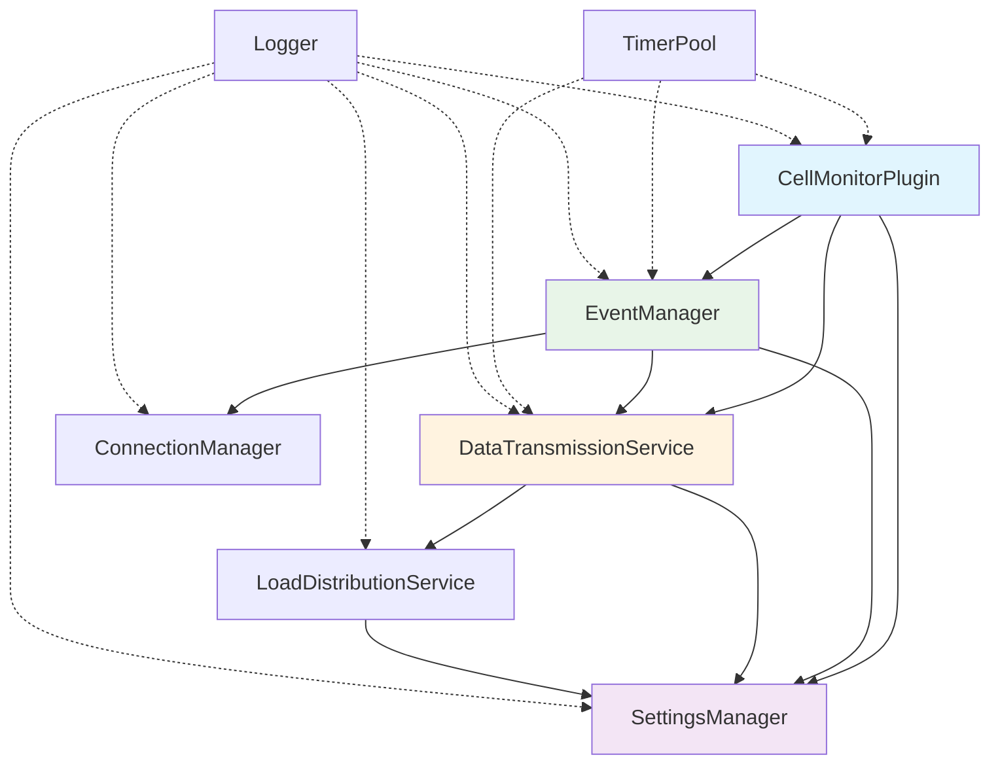

# Core Classes API - Cell Monitor Extension

**最終更新**: 2025-08-29  
**対象バージョン**: v1.1.4

## 📋 概要

Cell Monitor Extension v1.1.4 のコアクラスAPIリファレンスです。モジュール化されたクラスベース設計により、関心の分離と高い保守性を実現しています。

---

## 🏗️ コアクラス一覧

### 1. CellMonitorPlugin (メインプラグインクラス)

**ファイル**: `src/index.ts`

```typescript
class CellMonitorPlugin {
  private app: JupyterFrontEnd;
  private settingsManager: SettingsManager;
  private dataTransmissionService: DataTransmissionService;
  private eventManager: EventManager;
  private logger = createLogger('CellMonitorPlugin');

  constructor(
    app: JupyterFrontEnd,
    notebookTracker: INotebookTracker,
    settingRegistry: ISettingRegistry,
    labShell: ILabShell
  ): void

  private async initialize(
    settingRegistry: ISettingRegistry, 
    labShell: ILabShell
  ): Promise<void>

  private setupToolbarButtons(labShell: ILabShell): void
  private setupSettingsValidation(): void
  private startNewSession(): void
}
```

**責務**:
- JupyterLab拡張機能の初期化とライフサイクル管理
- 依存関係の注入とオーケストレーション
- ツールバーUI要素の設定
- 設定バリデーションの監視

---

### 2. SettingsManager (設定管理クラス)

**ファイル**: `src/core/SettingsManager.ts`

```typescript
class SettingsManager {
  private settings: ISettingRegistry.ISettings | null = null;
  private logger = createLogger('SettingsManager');

  constructor(): void

  async initialize(
    settingRegistry: ISettingRegistry, 
    pluginId: string
  ): Promise<void>

  getUserInfo(): {
    emailAddress: string;
    userName: string;
    teamName: string;
  }

  getServerConfig(): {
    serverUrl: string;
    retryAttempts: number;
  }

  getNotificationSettings(): {
    showNotifications: boolean;
    animationEnabled: boolean;
  }

  validateTeamName(teamName: string): {
    isValid: boolean;
    error?: string;
  }

  private setupRealtimeValidation(
    settingRegistry: ISettingRegistry,
    pluginId: string
  ): void

  private validateAndUpdateSettings(): void
  getSettings(): ISettingRegistry.ISettings | null
}
```

**責務**:
- JupyterLab設定レジストリとの連携
- リアルタイム設定バリデーション
- チーム名の正規表現バリデーション
- 設定変更の監視と通知

---

### 3. EventManager (イベント管理クラス)

**ファイル**: `src/core/EventManager.ts`

```typescript
class EventManager {
  private notebookTracker: INotebookTracker;
  private settingsManager: SettingsManager;
  private dataTransmissionService: DataTransmissionService;
  private connectionManager: ConnectionManager;
  private logger = createLogger('EventManager');

  constructor(
    notebookTracker: INotebookTracker,
    settingsManager: SettingsManager,
    dataTransmissionService: DataTransmissionService
  ): void

  initialize(): void
  startNewSession(): void

  private trackNotebookEvents(notebook: NotebookPanel): void
  private handleCellExecution(
    cell: CodeCell,
    notebookPath: string
  ): Promise<void>

  private createProgressEvent(
    eventType: EventType,
    notebookPath: string,
    additionalData?: any
  ): IStudentProgressData

  private handleHelpRequest(
    notebookPanel: NotebookPanel,
    isRequesting: boolean
  ): Promise<void>

  private cleanup(): void
}
```

**責務**:
- JupyterLabイベントの監視とキャプチャ
- セル実行イベントの処理
- ヘルプリクエストシステムの管理
- セッション管理とクリーンアップ

---

### 4. DataTransmissionService (データ送信サービス)

**ファイル**: `src/services/DataTransmissionService.ts`

```typescript
class DataTransmissionService {
  private settingsManager: SettingsManager;
  private loadDistributionService: LoadDistributionService;
  private logger = createLogger('DataTransmissionService');
  private axiosInstance: AxiosInstance;
  private legacyAxiosInstance: AxiosInstance;
  private pendingRequests: Map<string, Promise<void>> = new Map();

  constructor(settingsManager: SettingsManager): void

  async sendProgressData(data: IStudentProgressData): Promise<void>
  async sendBatchProgressData(
    dataArray: IStudentProgressData[]
  ): Promise<void>

  private async executeWithDuplicationPrevention<T>(
    key: string,
    operation: () => Promise<T>
  ): Promise<T | null>

  private async sendWithRetry(
    data: IStudentProgressData,
    maxAttempts?: number
  ): Promise<void>

  private handleTransmissionError(
    error: Error,
    data: IStudentProgressData,
    context: string
  ): void

  private startConnectionPoolCleanup(): void
  private cleanupConnectionPool(): void
  destroy(): void
}
```

**責務**:
- FastAPIサーバーへのHTTP通信
- 接続プール最適化とバッチ処理
- 重複送信防止機能
- エラーハンドリングとリトライ機能

---

### 5. LoadDistributionService (負荷分散サービス)

**ファイル**: `src/services/LoadDistributionService.ts`

```typescript
class LoadDistributionService {
  private settingsManager: SettingsManager;
  private logger = createLogger('LoadDistributionService');

  constructor(settingsManager: SettingsManager): void

  async getOptimalEndpoint(): Promise<string>
  async validateEndpoint(url: string): Promise<boolean>

  private async checkEndpointHealth(url: string): Promise<{
    available: boolean;
    responseTime: number;
  }>

  private getServerList(): string[]
  private selectBestServer(
    healthResults: Array<{
      url: string;
      available: boolean;
      responseTime: number;
    }>
  ): string
}
```

**責務**:
- 複数サーバーエンドポイントの管理
- サーバーヘルスチェック
- 負荷分散とフェイルオーバー

---

### 6. ConnectionManager (接続管理クラス)

**ファイル**: `src/core/ConnectionManager.ts`

```typescript
class ConnectionManager {
  private logger = createLogger('ConnectionManager');
  private connectionPool: Map<string, any> = new Map();

  constructor(): void

  async createConnection(endpoint: string): Promise<any>
  async getConnection(endpoint: string): Promise<any>
  cleanupConnections(): void
  getConnectionStats(): {
    activeConnections: number;
    totalCreated: number;
  }

  private validateConnection(connection: any): boolean
  private recycleConnection(endpoint: string): void
}
```

**責務**:
- HTTP接続プールの管理
- 接続の再利用と最適化
- 接続統計とモニタリング

---

## 🛠️ ユーティリティクラス

### TimerPool (タイマープール)

**ファイル**: `src/utils/TimerPool.ts`

```typescript
class TimerPool {
  private static instance: TimerPool;
  private timers: Map<string, NodeJS.Timeout> = new Map();
  private logger = createLogger('TimerPool');

  static getInstance(): TimerPool
  
  setTimeout(
    callback: () => void,
    delay: number,
    id?: string
  ): string

  clearTimeout(id: string): boolean
  clearAll(): void
  
  getStats(): {
    activeTimers: number;
    totalCreated: number;
  }
}
```

**責務**:
- タイマーリソースの効率的管理
- メモリリークの防止
- シングルトンパターンによるグローバル管理

---

## 🔗 クラス間の依存関係



## 📊 パフォーマンス特性

### 処理能力
- **並列イベント処理**: 毎秒6,999+イベント
- **同時接続**: 200名対応
- **メモリ効率**: 最適化されたリソース管理

### 最適化機能
- **HTTP接続プール**: axios インスタンス再利用
- **重複排除**: pendingRequests Map制御
- **バッチ処理**: 複数イベント一括処理
- **負荷分散**: 動的エンドポイント選択

---

**最終更新**: 2025-08-29  
**保守担当**: AI開発チーム + 人間開発者