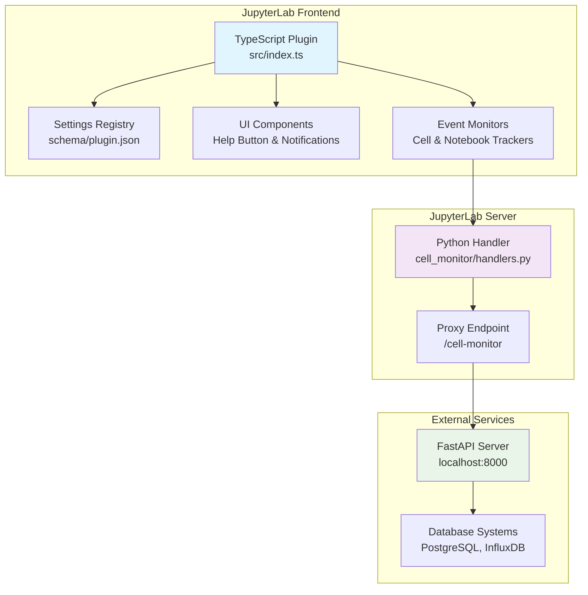
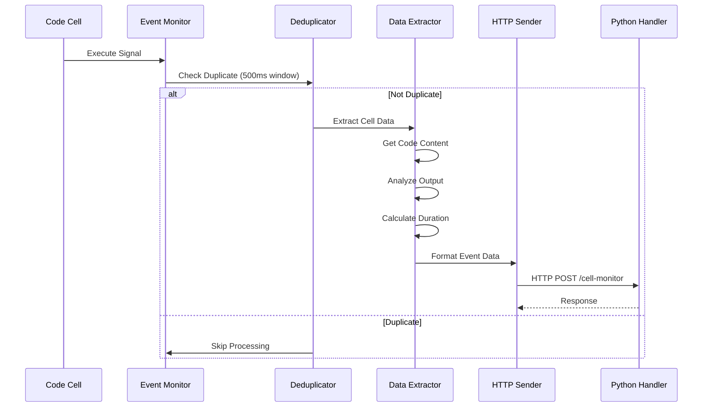
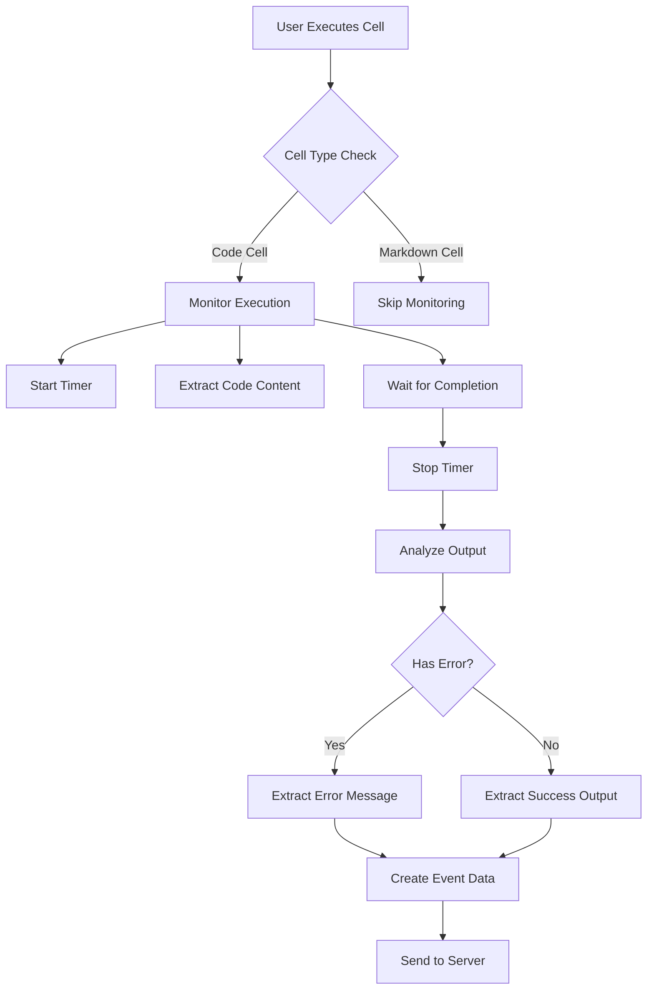

# System Architecture - Cell Monitor Extension

JupyterLab Cell Monitor Extension のシステムアーキテクチャとコンポーネント間の関係について説明します。

## 🏗️ 全体アーキテクチャ

### アーキテクチャ概要図



## 🔧 コアコンポーネント

### 1. TypeScript Frontend Plugin

**ファイル**: `src/index.ts` (900+ lines)

#### 主要責務
- JupyterLabプラグインシステムとの統合
- セル実行イベントの監視と処理
- ユーザーインターフェース管理
- 設定システムとの連携
- データ収集とサーバー送信

#### 技術実装
```typescript
const plugin: JupyterFrontEndPlugin<void> = {
  id: PLUGIN_ID,
  autoStart: true,
  requires: [INotebookTracker, ISettingRegistry, ILabShell],
  activate: (app, notebookTracker, settingRegistry, labShell) => {
    // プラグイン初期化ロジック
  }
};
```

#### 設計パターン
- **Observer Pattern**: JupyterLabシグナルによるイベント監視
- **Strategy Pattern**: 複数のデータ抽出方法の切り替え
- **Singleton Pattern**: グローバル設定管理
- **Proxy Pattern**: サーバー通信の抽象化

### 2. Data Models

#### IStudentProgressData Interface
```typescript
interface IStudentProgressData {
  eventId: string;           // UUID v4
  eventType: EventType;      // セル実行、ノートブック操作等
  userId: string;            // ユーザー識別子
  sessionId: string;         // セッション識別子
  notebookPath: string;      // ノートブックファイルパス
  cellId?: string;           // セルの固有ID
  cellIndex?: number;        // セルのインデックス
  code?: string;             // 実行コード
  executionCount?: number;   // 実行回数
  executionDurationMs?: number; // 実行時間（ミリ秒）
  hasError?: boolean;        // エラー有無
  errorMessage?: string;     // エラーメッセージ
  output?: string;          // 実行結果
  timestamp?: string;       // タイムスタンプ（ISO 8601）
}
```

#### Event Types
```typescript
type EventType =
  | 'cell_executed'         // セル実行
  | 'notebook_opened'       // ノートブック開始
  | 'notebook_saved'        // ノートブック保存
  | 'notebook_closed'       // ノートブック終了
  | 'help'                 // ヘルプ要請
  | 'help_stop';           // ヘルプ終了
```

### 3. Event Processing Pipeline

#### 処理フロー


#### 重複排除ロジック
```typescript
const processedCells = new Set<string>();

function isDuplicateExecution(cellId: string): boolean {
  if (processedCells.has(cellId)) {
    return true;
  }

  processedCells.add(cellId);

  // 500ms後にクリーンアップ
  setTimeout(() => {
    processedCells.delete(cellId);
  }, 500);

  return false;
}
```

### 4. Help Request System

#### UI コンポーネント
```typescript
function createHelpButton(): HTMLButtonElement {
  const button = document.createElement('button');
  button.className = 'jp-ToolbarButtonComponent jp-Button';
  button.setAttribute('aria-label', 'ヘルプを要請');
  button.setAttribute('role', 'button');
  button.setAttribute('tabindex', '0');

  // アクセシビリティ対応
  button.addEventListener('keydown', handleKeyboardNavigation);

  return button;
}
```

#### 自動ヘルプシグナル
```typescript
let helpTimer: NodeJS.Timeout;

function startHelpSignal(): void {
  helpTimer = setInterval(() => {
    sendEventData({
      eventType: 'help',
      eventId: generateUUID(),
      // ... その他のデータ
    });
  }, 5000); // 5秒間隔
}
```

### 5. Python Server Extension

**ファイル**: `cell_monitor/handlers.py`

#### CellMonitorProxyHandler
```python
from jupyter_server.base.handlers import APIHandler
from tornado.httpclient import AsyncHTTPClient

class CellMonitorProxyHandler(APIHandler):
    """
    JupyterLabからFastAPIサーバーへのプロキシハンドラー
    CORS問題を回避し、認証情報を適切に処理
    """

    @tornado.web.authenticated
    async def post(self):
        try:
            # リクエストボディの検証
            body = self.get_json_body()

            # テストモード判定
            if self.is_test_mode(body):
                server_url = TEST_FASTAPI_URL
            else:
                server_url = FASTAPI_URL

            # FastAPIサーバーへ転送
            client = AsyncHTTPClient()
            response = await client.fetch(
                f"{server_url}/api/v1/events",
                method="POST",
                body=json.dumps(body),
                headers={"Content-Type": "application/json"}
            )

            # レスポンス返却
            self.set_status(response.code)
            self.write(response.body)

        except Exception as e:
            self.log.error(f"Proxy error: {e}")
            self.set_status(500)
            self.write({"error": str(e)})
```

#### 拡張機能登録
```python
# cell_monitor/__init__.py
def _jupyter_server_extension_points():
    return [{"module": "cell_monitor"}]

def _load_jupyter_server_extension(server_app):
    """JupyterLabサーバーに拡張機能を登録"""
    handlers = [
        (r"/cell-monitor", CellMonitorProxyHandler),
    ]

    server_app.web_app.add_handlers(".*$", handlers)
```

## ⚙️ 設定システムアーキテクチャ

### Settings Schema

**ファイル**: `schema/plugin.json`

```json
{
  "type": "object",
  "title": "セルモニター設定",
  "description": "JupyterLabセルモニター拡張機能の設定",
  "properties": {
    "serverUrl": {
      "type": "string",
      "title": "サーバーURL",
      "description": "データ送信先のFastAPIサーバーURL",
      "default": ""
    },
    "userId": {
      "type": "string",
      "title": "ユーザーID",
      "description": "ユーザーの識別子（空白の場合は自動生成）",
      "default": ""
    },
    "batchSize": {
      "type": "integer",
      "title": "バッチサイズ",
      "description": "一度に送信するイベント数",
      "minimum": 1,
      "maximum": 100,
      "default": 1
    },
    "showNotifications": {
      "type": "boolean",
      "title": "通知表示",
      "description": "通知メッセージの表示/非表示",
      "default": true
    }
  }
}
```

### 動的設定管理

```typescript
let globalSettings: ISettings = {
  serverUrl: '',
  userId: '',
  userName: 'Anonymous',
  batchSize: 1,
  retryAttempts: 3,
  maxNotifications: 3,
  showNotifications: true
};

function loadSettings(settings: ISettingRegistry.ISettings): void {
  const composite = settings.composite as ISettings;

  // 設定の更新
  Object.assign(globalSettings, composite);

  // ユーザーIDの自動生成
  if (!globalSettings.userId) {
    globalSettings.userId = generateUUID();
    settings.set('userId', globalSettings.userId);
  }
}
```

## 🔄 データフロー詳細

### 1. Cell Execution Flow



### 2. Server Communication Flow

```typescript
async function sendEventData(data: IStudentProgressData): Promise<void> {
  const maxRetries = globalSettings.retryAttempts;
  let attempt = 0;

  while (attempt < maxRetries) {
    try {
      // JupyterLabプロキシ経由での送信
      const response = await fetch('/cell-monitor', {
        method: 'POST',
        headers: {
          'Content-Type': 'application/json',
        },
        body: JSON.stringify(data),
      });

      if (response.ok) {
        break; // 成功時は終了
      }

    } catch (error) {
      console.error(`Attempt ${attempt + 1} failed:`, error);
    }

    attempt++;

    // 指数バックオフ
    const delay = Math.pow(2, attempt) * 1000;
    await new Promise(resolve => setTimeout(resolve, delay));
  }
}
```

## 🎭 エラーハンドリング戦略

### 1. フロントエンド例外処理

```typescript
try {
  // セル実行の監視
  await processCellExecution(cell);
} catch (error) {
  // ログ記録
  console.error('Cell monitoring error:', error);

  // ユーザー通知（設定に応じて）
  if (globalSettings.showNotifications) {
    showErrorNotification('セル監視でエラーが発生しました');
  }

  // エラーイベントの送信
  sendEventData({
    eventType: 'error',
    errorMessage: error.message,
    // ...
  });
}
```

### 2. サーバーサイド例外処理

```python
async def post(self):
    try:
        # プロキシ処理
        await self.proxy_request()
    except json.JSONDecodeError:
        self.set_status(400)
        self.write({"error": "Invalid JSON format"})
    except Exception as e:
        self.log.exception("Unexpected error in proxy handler")
        self.set_status(500)
        self.write({"error": "Internal server error"})
```

## 📊 パフォーマンス考慮事項

### 1. メモリ管理

```typescript
// 処理済みセルのクリーンアップ
const CLEANUP_INTERVAL = 30000; // 30秒

setInterval(() => {
  const now = Date.now();

  for (const [cellId, timestamp] of processedCells.entries()) {
    if (now - timestamp > CLEANUP_INTERVAL) {
      processedCells.delete(cellId);
    }
  }
}, CLEANUP_INTERVAL);
```

### 2. ネットワーク最適化

- **重複排除**: 500ms以内の重複イベントをフィルタリング
- **バッチ処理**: 設定可能なバッチサイズでの一括送信
- **圧縮**: 大きなコードコンテンツの圧縮送信
- **リトライ**: 指数バックオフによる信頼性向上

### 3. UI応答性

- **非同期処理**: すべてのネットワーク通信を非同期実行
- **UI分離**: データ処理がUIをブロックしない設計
- **進行状況表示**: 長時間処理の進行状況を表示

---

## 🔧 拡張性とメンテナンス

### モジュール構成
現在の実装は単一ファイル（900+ lines）ですが、以下のような分割が可能：

```
src/
├── index.ts              # プラグインエントリーポイント
├── core/
│   ├── eventMonitor.ts   # イベント監視ロジック
│   ├── dataExtractor.ts  # データ抽出ロジック
│   └── serverComm.ts     # サーバー通信
├── ui/
│   ├── helpButton.ts     # ヘルプボタンUI
│   └── notifications.ts # 通知システム
└── utils/
    ├── uuid.ts           # UUID生成
    └── deduplicator.ts   # 重複排除
```

### 設定拡張性
JSON Schemaベースの設定により、新しい設定項目の追加が容易：

```json
{
  "newFeatureEnabled": {
    "type": "boolean",
    "title": "新機能有効化",
    "default": false
  }
}
```

この設計により、堅牢で拡張性の高いJupyterLab拡張機能を実現しています。
