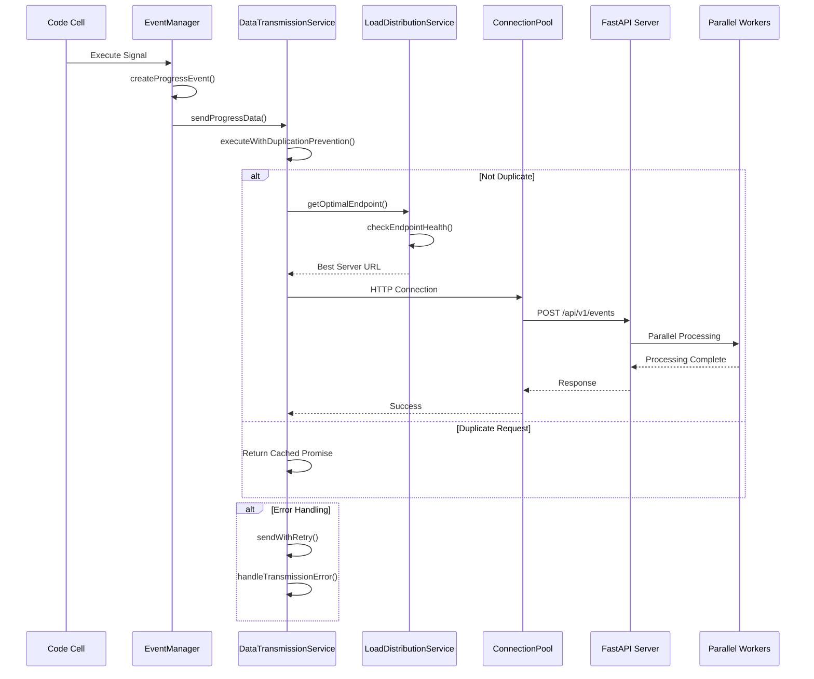

# Event Processing System - Cell Monitor Extension

**最終更新**: 2025-08-29  
**対象バージョン**: v1.1.4

## 📋 概要

Cell Monitor Extension の高性能イベント処理システム（毎秒6,999+イベント処理対応）の詳細について説明します。

---

## 🔄 Event Processing Pipeline

### 処理フロー詳細



### 重複排除システム

```typescript
const processedCells = new Set<string>();

function isDuplicateExecution(cellId: string): boolean {
  if (processedCells.has(cellId)) {
    return true;
  }

  processedCells.add(cellId);

  // 500ms後にクリーンアップ
  setTimeout(() => {
    processedCells.delete(cellId);
  }, 500);

  return false;
}
```

---

## 📊 イベント監視システム

### セル実行監視

```typescript
function setupCellExecutionMonitoring(notebookTracker: INotebookTracker): void {
  notebookTracker.currentChanged.connect((_, notebook) => {
    if (!notebook) return;

    // 既存のリスナーをクリーンアップ
    cleanupExistingListeners(notebook);

    // 新しいセルの監視を開始
    notebook.model?.cells.changed.connect(handleCellsChanged);

    // 既存セルに監視を追加
    for (let i = 0; i < notebook.model?.cells.length; i++) {
      const cell = notebook.model?.cells.get(i);
      if (cell && cell.type === 'code') {
        addCellExecutionListener(cell as ICodeCellModel, i);
      }
    }
  });
}
```

### コードセル処理

```typescript
function addCellExecutionListener(cell: ICodeCellModel, index: number): void {
  // 実行完了の監視
  cell.stateChanged.connect((sender, args) => {
    if (args.name === 'executionCount' && args.newValue !== null) {
      const cellId = cell.id || `cell-${index}`;
      
      // 重複チェック
      if (isDuplicateExecution(cellId)) {
        return;
      }

      // セルデータの抽出と送信
      processCellExecution(cell, index);
    }
  });
}
```

---

## 🎯 Help Request System

### ヘルプボタン実装

```typescript
function createHelpButton(): HTMLButtonElement {
  const button = document.createElement('button');
  button.className = 'jp-ToolbarButtonComponent jp-Button';
  button.setAttribute('aria-label', 'ヘルプを要請');
  button.setAttribute('role', 'button');
  button.setAttribute('tabindex', '0');

  // SVGアイコンの追加
  const icon = document.createElementNS('http://www.w3.org/2000/svg', 'svg');
  icon.setAttribute('viewBox', '0 0 24 24');
  icon.setAttribute('width', '16');
  icon.setAttribute('height', '16');
  icon.innerHTML = `
    <path d="M12 2C6.48 2 2 6.48 2 12s4.48 10 10 10 10-4.48 10-10S17.52 2 12 2zm1 17h-2v-2h2v2zm2.07-7.75l-.9.92C13.45 12.9 13 13.5 13 15h-2v-.5c0-1.1.45-2.1 1.17-2.83l1.24-1.26c.37-.36.59-.86.59-1.41 0-1.1-.9-2-2-2s-2 .9-2 2H8c0-2.21 1.79-4 4-4s4 1.79 4 4c0 .88-.36 1.68-.93 2.25z"/>
  `;
  
  button.appendChild(icon);

  // アクセシビリティ対応
  button.addEventListener('keydown', handleKeyboardNavigation);

  return button;
}
```

### 自動ヘルプシグナル

```typescript
let helpTimer: NodeJS.Timeout | null = null;
let isHelpActive = false;

function startHelpSignal(): void {
  if (isHelpActive) return;

  isHelpActive = true;
  helpTimer = setInterval(() => {
    sendEventData({
      eventId: generateUUID(),
      eventType: 'help',
      eventTime: new Date().toISOString(),
      emailAddress: globalSettings.emailAddress || 'unknown',
      userName: globalSettings.userName || 'Anonymous',
      teamName: globalSettings.teamName || '',
      sessionId: getSessionId(),
      notebookPath: getCurrentNotebookPath()
    });
  }, 5000); // 5秒間隔

  // UI状態の更新
  updateHelpButtonState(true);
}

function stopHelpSignal(): void {
  if (!isHelpActive) return;

  isHelpActive = false;
  
  if (helpTimer) {
    clearInterval(helpTimer);
    helpTimer = null;
  }

  // 終了イベントの送信
  sendEventData({
    eventId: generateUUID(),
    eventType: 'help_stop',
    eventTime: new Date().toISOString(),
    emailAddress: globalSettings.emailAddress || 'unknown',
    userName: globalSettings.userName || 'Anonymous',
    teamName: globalSettings.teamName || '',
    sessionId: getSessionId(),
    notebookPath: getCurrentNotebookPath()
  });

  // UI状態の更新
  updateHelpButtonState(false);
}
```

---

## 🎭 エラーハンドリング戦略

### フロントエンド例外処理

```typescript
try {
  // セル実行の監視
  await processCellExecution(cell, index);
} catch (error) {
  // ログ記録
  console.error('Cell monitoring error:', error);

  // ユーザー通知（設定に応じて）
  if (globalSettings.showNotifications) {
    showErrorNotification('セル監視でエラーが発生しました');
  }

  // エラーイベントの送信
  sendEventData({
    eventId: generateUUID(),
    eventType: 'error',
    eventTime: new Date().toISOString(),
    errorMessage: error.message,
    emailAddress: globalSettings.emailAddress || 'unknown',
    userName: globalSettings.userName || 'Anonymous',
    teamName: globalSettings.teamName || '',
    sessionId: getSessionId(),
    notebookPath: getCurrentNotebookPath()
  });
}
```

### データ抽出エラー処理

```typescript
function extractCellData(cell: ICodeCellModel, cellIndex: number): IStudentProgressData {
  try {
    const executionStartTime = performance.now();
    
    const data: IStudentProgressData = {
      eventId: generateUUID(),
      eventType: 'cell_executed',
      eventTime: new Date().toISOString(),
      emailAddress: globalSettings.emailAddress || 'unknown',
      userName: globalSettings.userName || 'Anonymous',
      teamName: globalSettings.teamName || '',
      sessionId: getSessionId(),
      notebookPath: getCurrentNotebookPath(),
      cellId: cell.id || `cell-${cellIndex}`,
      cellIndex,
      cellType: cell.type as CellType,
      code: cell.sharedModel.source || '',
      executionCount: cell.executionCount || undefined
    };

    // エラー情報の抽出
    const outputs = cell.outputs;
    let hasError = false;
    let errorMessage = '';
    let result = '';

    for (let i = 0; i < outputs.length; i++) {
      const output = outputs.get(i);
      
      if (output?.type === 'error') {
        hasError = true;
        errorMessage = extractErrorMessage(output);
        break;
      } else if (output?.type === 'execute_result' || output?.type === 'display_data') {
        result = extractOutputText(output);
      }
    }

    data.hasError = hasError;
    data.errorMessage = errorMessage;
    data.result = result;
    data.executionDurationMs = performance.now() - executionStartTime;

    return data;

  } catch (error) {
    console.error('Error extracting cell data:', error);
    
    // フォールバックデータの返却
    return {
      eventId: generateUUID(),
      eventType: 'cell_executed',
      eventTime: new Date().toISOString(),
      emailAddress: globalSettings.emailAddress || 'unknown',
      userName: globalSettings.userName || 'Anonymous',
      teamName: globalSettings.teamName || '',
      sessionId: getSessionId(),
      notebookPath: getCurrentNotebookPath(),
      hasError: true,
      errorMessage: `Data extraction error: ${error.message}`
    };
  }
}
```

---

## 📊 パフォーマンス最適化

### メモリ管理

```typescript
// 処理済みセルのクリーンアップ
const CLEANUP_INTERVAL = 30000; // 30秒
const processedCells = new Map<string, number>();

setInterval(() => {
  const now = Date.now();

  for (const [cellId, timestamp] of processedCells.entries()) {
    if (now - timestamp > CLEANUP_INTERVAL) {
      processedCells.delete(cellId);
    }
  }
}, CLEANUP_INTERVAL);

function trackProcessedCell(cellId: string): void {
  processedCells.set(cellId, Date.now());
}
```

### バッチ処理システム

```typescript
class EventBatcher {
  private eventQueue: IStudentProgressData[] = [];
  private batchTimer: NodeJS.Timeout | null = null;
  private readonly batchSize: number;
  private readonly flushInterval: number;

  constructor(batchSize: number = 1, flushInterval: number = 1000) {
    this.batchSize = batchSize;
    this.flushInterval = flushInterval;
  }

  public addEvent(event: IStudentProgressData): void {
    this.eventQueue.push(event);

    // バッチサイズに達したら即座に送信
    if (this.eventQueue.length >= this.batchSize) {
      this.flush();
    } else {
      // タイマーでの自動フラッシュを設定
      if (!this.batchTimer) {
        this.batchTimer = setTimeout(() => {
          this.flush();
        }, this.flushInterval);
      }
    }
  }

  private flush(): void {
    if (this.eventQueue.length === 0) return;

    const eventsToSend = [...this.eventQueue];
    this.eventQueue = [];

    if (this.batchTimer) {
      clearTimeout(this.batchTimer);
      this.batchTimer = null;
    }

    // バッチ送信
    this.sendBatch(eventsToSend);
  }

  private async sendBatch(events: IStudentProgressData[]): Promise<void> {
    try {
      await sendEventData(events.length === 1 ? events[0] : events);
    } catch (error) {
      console.error('Batch send failed:', error);
      
      // エラー時は個別送信を試行
      for (const event of events) {
        try {
          await sendEventData(event);
        } catch (individualError) {
          console.error('Individual event send failed:', individualError);
        }
      }
    }
  }
}
```

---

## 🔗 関連ドキュメント

- [System Overview](SYSTEM_OVERVIEW.md) - システム全体像
- [Server Components](SYSTEM_SERVER_COMPONENTS.md) - サーバーコンポーネント
- [Implementation & Testing](../dev/IMPLEMENTATION_TESTING.md) - 実装ガイド

**最終更新**: 2025-08-24  
**対応バージョン**: v1.1.0