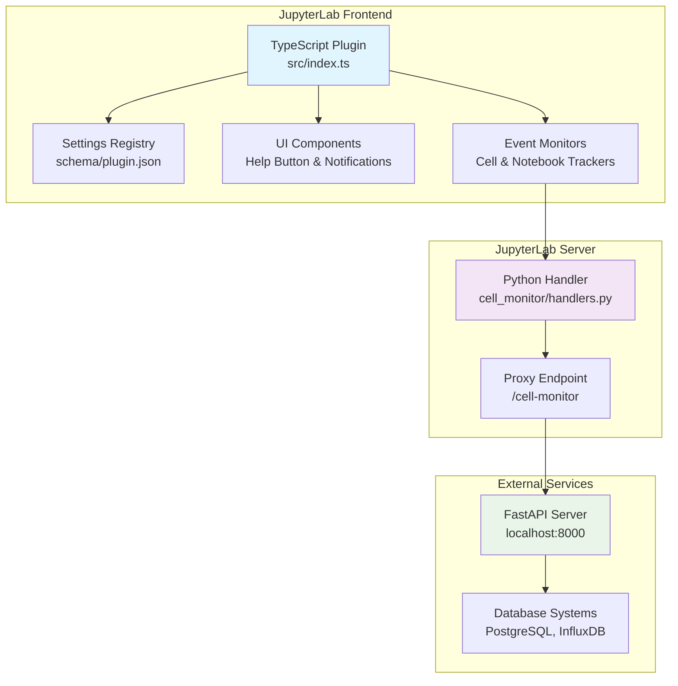
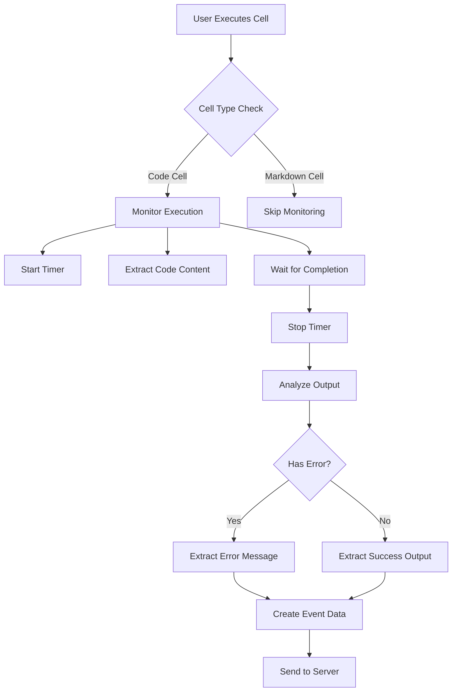

# System Overview - Cell Monitor Extension

**最終更新**: 2025-08-24  
**対象バージョン**: v1.1.0

## 📋 概要

Cell Monitor Extension のシステム全体像とアーキテクチャの概要について説明します。

---

## 🏗️ 全体アーキテクチャ

### システム概要図



---

## 🔧 主要コンポーネント

### 1. TypeScript Frontend Plugin

**ファイル**: `src/index.ts` (117行) と関連モジュール群

#### 主要責務
- JupyterLabプラグインシステムとの統合
- セル実行イベントの監視と処理
- ユーザーインターフェース管理
- 設定システムとの連携
- データ収集とサーバー送信

#### 技術実装
```typescript
const plugin: JupyterFrontEndPlugin<void> = {
  id: PLUGIN_ID,
  autoStart: true,
  requires: [INotebookTracker, ISettingRegistry, ILabShell],
  activate: (app, notebookTracker, settingRegistry, labShell) => {
    // プラグイン初期化ロジック
  }
};
```

#### 設計パターン
- **Observer Pattern**: JupyterLabシグナルによるイベント監視
- **Strategy Pattern**: 複数のデータ抽出方法の切り替え
- **Singleton Pattern**: グローバル設定管理
- **Proxy Pattern**: サーバー通信の抽象化

---

## 📊 データモデル

### IStudentProgressData Interface

```typescript
interface IStudentProgressData {
  eventId: string;           // UUID v4
  eventType: EventType;      // セル実行、ノートブック操作等
  eventTime: string;         // イベント発生時刻 (ISO 8601形式)
  emailAddress: string;      // 受講生のメールアドレス
  userName: string;          // 受講生の表示名
  teamName: string;          // 受講生の所属チーム名
  sessionId: string;         // セッション識別子
  notebookPath: string;      // ノートブックファイルパス
  cellId?: string;           // セルの固有ID
  cellIndex?: number;        // セルのインデックス
  cellType?: CellType;       // セルの種類
  code?: string;             // 実行コード
  executionCount?: number;   // 実行回数
  hasError?: boolean;        // エラー有無
  errorMessage?: string;     // エラーメッセージ
  result?: string;           // 実行結果
  executionDurationMs?: number; // 実行時間（ミリ秒）
}
```

### Event Types

```typescript
type EventType =
  | 'cell_executed'         // セル実行
  | 'notebook_opened'       // ノートブック開始
  | 'notebook_saved'        // ノートブック保存
  | 'notebook_closed'       // ノートブック終了
  | 'help'                 // ヘルプ要請
  | 'help_stop';           // ヘルプ終了
```

---

## ⚙️ 設定システム

### Settings Schema

**ファイル**: `schema/plugin.json`

```json
{
  "type": "object",
  "title": "セルモニター設定",
  "description": "JupyterLabセルモニター拡張機能の設定",
  "properties": {
    "serverUrl": {
      "type": "string",
      "title": "サーバーURL",
      "description": "データ送信先のFastAPIサーバーURL",
      "default": ""
    },
    "userId": {
      "type": "string",
      "title": "ユーザーID",
      "description": "ユーザーの識別子（空白の場合は自動生成）",
      "default": ""
    },
    "batchSize": {
      "type": "integer",
      "title": "バッチサイズ",
      "description": "一度に送信するイベント数",
      "minimum": 1,
      "maximum": 100,
      "default": 1
    },
    "showNotifications": {
      "type": "boolean",
      "title": "通知表示",
      "description": "通知メッセージの表示/非表示",
      "default": true
    }
  }
}
```

### 動的設定管理

```typescript
let globalSettings: ISettings = {
  serverUrl: '',
  userId: '',
  userName: 'Anonymous',
  batchSize: 1,
  retryAttempts: 3,
  maxNotifications: 3,
  showNotifications: true
};

function loadSettings(settings: ISettingRegistry.ISettings): void {
  const composite = settings.composite as ISettings;

  // 設定の更新
  Object.assign(globalSettings, composite);

  // ユーザーIDの自動生成
  if (!globalSettings.userId) {
    globalSettings.userId = generateUUID();
    settings.set('userId', globalSettings.userId);
  }
}
```

---

## 🔄 データフロー概要

### Cell Execution Flow



### Server Communication

```typescript
async function sendEventData(data: IStudentProgressData): Promise<void> {
  const maxRetries = globalSettings.retryAttempts;
  let attempt = 0;

  while (attempt < maxRetries) {
    try {
      // JupyterLabプロキシ経由での送信
      const response = await fetch('/cell-monitor', {
        method: 'POST',
        headers: {
          'Content-Type': 'application/json',
        },
        body: JSON.stringify(data),
      });

      if (response.ok) {
        break; // 成功時は終了
      }

    } catch (error) {
      console.error(`Attempt ${attempt + 1} failed:`, error);
    }

    attempt++;

    // 指数バックオフ
    const delay = Math.pow(2, attempt) * 1000;
    await new Promise(resolve => setTimeout(resolve, delay));
  }
}
```

---

## 📊 パフォーマンス特性

### 最適化機能

- **重複排除**: 500ms以内の重複イベントをフィルタリング
- **バッチ処理**: 設定可能なバッチサイズでの一括送信
- **圧縮**: 大きなコードコンテンツの圧縮送信
- **リトライ**: 指数バックオフによる信頼性向上

### UI応答性

- **非同期処理**: すべてのネットワーク通信を非同期実行
- **UI分離**: データ処理がUIをブロックしない設計
- **進行状況表示**: 長時間処理の進行状況を表示

---

## 🔧 拡張性設計

### モジュール構成案

現在の実装は単一ファイル（900+ lines）ですが、以下のような分割が可能：

```
src/
├── index.ts              # プラグインエントリーポイント
├── core/
│   ├── eventMonitor.ts   # イベント監視ロジック
│   ├── dataExtractor.ts  # データ抽出ロジック
│   └── serverComm.ts     # サーバー通信
├── ui/
│   ├── helpButton.ts     # ヘルプボタンUI
│   └── notifications.ts # 通知システム
└── utils/
    ├── uuid.ts           # UUID生成
    └── deduplicator.ts   # 重複排除
```

### 設定拡張性

JSON Schemaベースの設定により、新しい設定項目の追加が容易：

```json
{
  "newFeatureEnabled": {
    "type": "boolean",
    "title": "新機能有効化",
    "default": false
  }
}
```

---

## 🔗 関連ドキュメント

- [Event Processing](SYSTEM_EVENT_PROCESSING.md) - イベント処理詳細
- [Server Components](SYSTEM_SERVER_COMPONENTS.md) - サーバーコンポーネント詳細
- [JupyterLab Integration](../integration/JUPYTERLAB_INTEGRATION.md) - JupyterLab統合

**最終更新**: 2025-08-24  
**対応バージョン**: v1.1.0