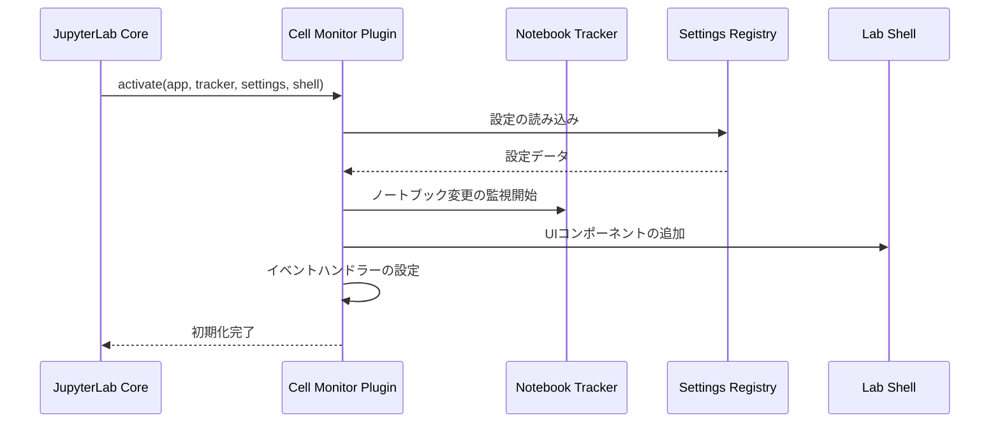

# Core JupyterLab Integration - Cell Monitor Extension

**最終更新**: 2025-08-24  
**対象バージョン**: v1.1.0

## 📋 概要

Cell Monitor ExtensionのJupyterLabプラグインシステムとの統合とノートブック監視機能について説明します。

---

## 🔗 JupyterLab プラグインシステム

### プラグインアーキテクチャ

Cell Monitor ExtensionはJupyterLab 4.xの**プラグインシステム**を活用しています。

```typescript
// src/index.ts - プラグイン定義
const plugin: JupyterFrontEndPlugin<void> = {
  id: 'cell-monitor:plugin',          // プラグインの一意識別子
  autoStart: true,                    // JupyterLab起動時に自動開始
  requires: [                         // 依存する他のプラグイン
    INotebookTracker,                 // ノートブック追跡機能
    ISettingRegistry,                 // 設定管理システム
    ILabShell                         // JupyterLabシェル操作
  ],
  optional: [IStatusBar],             // オプショナル依存関係
  activate: activatePlugin            // プラグイン初期化関数
};

export default plugin;
```

### プラグイン初期化フロー



---

## 📔 ノートブック統合

### INotebookTracker との連携

```typescript
function activatePlugin(
  app: JupyterFrontEnd,
  notebookTracker: INotebookTracker,
  settingRegistry: ISettingRegistry,
  labShell: ILabShell
): void {
  console.log('Cell Monitor Extension activated');

  // 現在のノートブック変更を監視
  notebookTracker.currentChanged.connect((tracker, notebook) => {
    if (notebook) {
      setupNotebookMonitoring(notebook);
    }
  });

  // 既存のノートブックにも適用
  if (notebookTracker.currentWidget) {
    setupNotebookMonitoring(notebookTracker.currentWidget);
  }
}
```

### ノートブックライフサイクル監視

```typescript
function setupNotebookMonitoring(notebookPanel: NotebookPanel): void {
  const { content: notebook, context } = notebookPanel;

  // ノートブック開始イベント
  sendEventData({
    eventType: 'notebook_opened',
    eventId: generateUUID(),
    userId: globalSettings.userId,
    sessionId: generateSessionId(),
    notebookPath: context.path,
    timestamp: new Date().toISOString()
  });

  // セル変更監視
  notebook.activeCellChanged.connect(onActiveCellChanged);

  // セル実行監視
  notebook.model?.cells.changed.connect(onCellsChanged);

  // ノートブック保存監視
  context.saveState.connect(onNotebookSave);

  // ノートブック終了監視（ウィンドウクローズ時）
  window.addEventListener('beforeunload', () => {
    sendEventData({
      eventType: 'notebook_closed',
      eventId: generateUUID(),
      userId: globalSettings.userId,
      sessionId: getSessionId(),
      notebookPath: context.path,
      timestamp: new Date().toISOString()
    });
  });
}
```

### セルレベルの監視

```typescript
function onActiveCellChanged(
  notebook: Notebook,
  cell: Cell | null
): void {
  if (!cell || cell.model.type !== 'code') {
    return;
  }

  const codeCell = cell as CodeCell;

  // セル実行開始の監視
  codeCell.model.stateChanged.connect((model, args) => {
    if (args.name === 'executionCount' && args.newValue !== null) {
      // セル実行開始
      startCellExecutionMonitoring(codeCell);
    }
  });
}

function startCellExecutionMonitoring(cell: CodeCell): void {
  const startTime = Date.now();
  const cellId = cell.model.id;

  // 重複実行チェック
  if (isDuplicateExecution(cellId)) {
    return;
  }

  // 実行完了を監視
  const checkCompletion = () => {
    if (!cell.model.executionCount || cell.model.executionCount === '*') {
      // まだ実行中
      setTimeout(checkCompletion, 100);
      return;
    }

    // 実行完了 - データ収集
    const executionTime = Date.now() - startTime;
    const cellData = extractCellData(cell, executionTime);
    sendEventData(cellData);
  };

  checkCompletion();
}
```

---

## 🔄 イベント処理の詳細

### セル実行イベントの捕捉

```typescript
function extractCellData(cell: CodeCell, executionTime: number): IStudentProgressData {
  const model = cell.model;
  
  return {
    eventId: generateUUID(),
    eventType: 'cell_executed',
    eventTime: new Date().toISOString(),
    emailAddress: globalSettings.emailAddress,
    userName: globalSettings.userName,
    teamName: globalSettings.teamName,
    sessionId: getSessionId(),
    notebookPath: getCurrentNotebookPath(),
    cellId: model.id,
    cellIndex: getCellIndex(cell),
    code: extractCellCode(cell),
    executionCount: model.executionCount as number,
    executionDurationMs: executionTime,
    hasError: checkCellHasError(cell),
    errorMessage: extractErrorMessage(cell),
    output: extractCellOutput(cell)
  };
}
```

### 重複実行の防止

```typescript
const processedCells = new Set<string>();

function isDuplicateExecution(cellId: string): boolean {
  if (processedCells.has(cellId)) {
    return true;
  }

  processedCells.add(cellId);

  // 500ms後にクリーンアップ
  setTimeout(() => {
    processedCells.delete(cellId);
  }, 500);

  return false;
}
```

### エラー検出とメッセージ抽出

```typescript
function checkCellHasError(cell: CodeCell): boolean {
  const outputs = cell.model.outputs;
  for (let i = 0; i < outputs.length; i++) {
    const output = outputs.get(i);
    if (output.type === 'error') {
      return true;
    }
  }
  return false;
}

function extractErrorMessage(cell: CodeCell): string | null {
  const outputs = cell.model.outputs;
  for (let i = 0; i < outputs.length; i++) {
    const output = outputs.get(i);
    if (output.type === 'error') {
      return `${output.ename}: ${output.evalue}`;
    }
  }
  return null;
}
```

---

## 🛠️ 高度な統合機能

### カスタムシグナルの実装

```typescript
import { ISignal, Signal } from '@lumino/signaling';

class CellMonitorSignals {
  private _cellExecuted = new Signal<this, IStudentProgressData>(this);
  private _helpRequested = new Signal<this, string>(this);

  get cellExecuted(): ISignal<this, IStudentProgressData> {
    return this._cellExecuted;
  }

  get helpRequested(): ISignal<this, string> {
    return this._helpRequested;
  }

  emitCellExecuted(data: IStudentProgressData): void {
    this._cellExecuted.emit(data);
  }

  emitHelpRequested(message: string): void {
    this._helpRequested.emit(message);
  }
}
```

### JupyterLabテーマとの統合

```typescript
function setupThemeIntegration(app: JupyterFrontEnd): void {
  const themeManager = app.serviceManager.themes;
  
  // テーマ変更の監視
  themeManager.themeChanged.connect((manager, args) => {
    updateUIStyles(args.newValue);
  });

  // 現在のテーマに応じてUIを調整
  const currentTheme = themeManager.theme;
  updateUIStyles(currentTheme);
}

function updateUIStyles(themeName: string): void {
  const helpButton = document.querySelector('.help-request-button');
  if (helpButton) {
    // ダークテーマ対応
    if (themeName.includes('dark')) {
      helpButton.classList.add('dark-theme');
    } else {
      helpButton.classList.remove('dark-theme');
    }
  }
}
```

---

## 🔗 関連ドキュメント

- [Configuration & UI Integration](CONFIGURATION_UI.md) - 設定システムとUI統合
- [Server & Advanced Integration](SERVER_ADVANCED.md) - サーバー拡張と高度な機能
- [System Architecture](../architecture/SYSTEM_ARCHITECTURE.md) - システムアーキテクチャ

**最終更新**: 2025-08-24  
**対応バージョン**: JupyterLab 4.2.4+