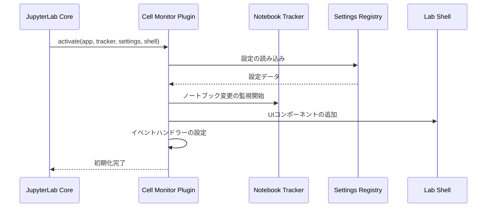

# JupyterLab統合ガイド

Cell Monitor ExtensionのJupyterLabとの統合方法と、JupyterLabエコシステムとの連携について説明します。

## 🔗 JupyterLab プラグインシステム

### プラグインアーキテクチャ

Cell Monitor ExtensionはJupyterLab 4.xの**プラグインシステム**を活用しています。

```typescript
// src/index.ts - プラグイン定義
const plugin: JupyterFrontEndPlugin<void> = {
  id: 'cell-monitor:plugin',          // プラグインの一意識別子
  autoStart: true,                    // JupyterLab起動時に自動開始
  requires: [                         // 依存する他のプラグイン
    INotebookTracker,                 // ノートブック追跡機能
    ISettingRegistry,                 // 設定管理システム
    ILabShell                         // JupyterLabシェル操作
  ],
  optional: [IStatusBar],             // オプショナル依存関係
  activate: activatePlugin            // プラグイン初期化関数
};

export default plugin;
```

### プラグイン初期化フロー



## 📔 ノートブック統合

### INotebookTracker との連携

```typescript
function activatePlugin(
  app: JupyterFrontEnd,
  notebookTracker: INotebookTracker,
  settingRegistry: ISettingRegistry,
  labShell: ILabShell
): void {
  console.log('Cell Monitor Extension activated');

  // 現在のノートブック変更を監視
  notebookTracker.currentChanged.connect((tracker, notebook) => {
    if (notebook) {
      setupNotebookMonitoring(notebook);
    }
  });

  // 既存のノートブックにも適用
  if (notebookTracker.currentWidget) {
    setupNotebookMonitoring(notebookTracker.currentWidget);
  }
}
```

### ノートブックライフサイクル監視

```typescript
function setupNotebookMonitoring(notebookPanel: NotebookPanel): void {
  const { content: notebook, context } = notebookPanel;

  // ノートブック開始イベント
  sendEventData({
    eventType: 'notebook_opened',
    eventId: generateUUID(),
    userId: globalSettings.userId,
    sessionId: generateSessionId(),
    notebookPath: context.path,
    timestamp: new Date().toISOString()
  });

  // セル変更監視
  notebook.activeCellChanged.connect(onActiveCellChanged);

  // セル実行監視
  notebook.model?.cells.changed.connect(onCellsChanged);

  // ノートブック保存監視
  context.saveState.connect(onNotebookSave);

  // ノートブック終了監視（ウィンドウクローズ時）
  window.addEventListener('beforeunload', () => {
    sendEventData({
      eventType: 'notebook_closed',
      eventId: generateUUID(),
      userId: globalSettings.userId,
      sessionId: getSessionId(),
      notebookPath: context.path,
      timestamp: new Date().toISOString()
    });
  });
}
```

### セルレベルの監視

```typescript
function onActiveCellChanged(
  notebook: Notebook,
  cell: Cell | null
): void {
  if (!cell || cell.model.type !== 'code') {
    return;
  }

  const codeCell = cell as CodeCell;

  // セル実行開始の監視
  codeCell.model.stateChanged.connect((model, args) => {
    if (args.name === 'executionCount' && args.newValue !== null) {
      // セル実行開始
      startCellExecutionMonitoring(codeCell);
    }
  });
}

function startCellExecutionMonitoring(cell: CodeCell): void {
  const startTime = Date.now();
  const cellId = cell.model.id;

  // 重複実行チェック
  if (isDuplicateExecution(cellId)) {
    return;
  }

  // 実行完了を監視
  const checkCompletion = () => {
    if (!cell.model.executionCount || cell.model.executionCount === '*') {
      // まだ実行中
      setTimeout(checkCompletion, 100);
      return;
    }

    // 実行完了 - データ収集
    const executionTime = Date.now() - startTime;
    const cellData = extractCellData(cell, executionTime);
    sendEventData(cellData);
  };

  checkCompletion();
}
```

## ⚙️ 設定システム統合

### JSON Schema ベース設定

JupyterLabの**設定レジストリ**と統合し、ユーザー設定を管理します。

```json
{
  "title": "セルモニター設定",
  "description": "JupyterLabセルモニター拡張機能の設定",
  "type": "object",
  "properties": {
    "serverUrl": {
      "type": "string",
      "title": "サーバーURL",
      "description": "データ送信先のFastAPIサーバーURL",
      "default": "",
      "pattern": "^https?://.+"
    },
    "userId": {
      "type": "string",
      "title": "ユーザーID",
      "description": "ユーザーの識別子（空白の場合は自動生成）",
      "default": "",
      "minLength": 0,
      "maxLength": 100
    },
    "batchSize": {
      "type": "integer",
      "title": "バッチサイズ",
      "description": "一度に送信するイベント数",
      "minimum": 1,
      "maximum": 100,
      "default": 1
    },
    "showNotifications": {
      "type": "boolean",
      "title": "通知表示",
      "description": "通知メッセージの表示/非表示",
      "default": true
    }
  },
  "additionalProperties": false
}
```

### 動的設定更新

```typescript
function loadSettings(settingRegistry: ISettingRegistry): void {
  settingRegistry.load(plugin.id).then(settings => {
    // 初期設定の読み込み
    updateGlobalSettings(settings.composite as ISettings);

    // 設定変更の監視
    settings.changed.connect(() => {
      updateGlobalSettings(settings.composite as ISettings);
      console.log('Settings updated:', globalSettings);
    });
  }).catch(error => {
    console.error('Failed to load settings:', error);
    // デフォルト設定で続行
  });
}

function updateGlobalSettings(newSettings: ISettings): void {
  Object.assign(globalSettings, newSettings);

  // ユーザーIDの自動生成
  if (!globalSettings.userId) {
    globalSettings.userId = generateUUID();
    // 設定に保存（次回起動時に使用）
    settingRegistry.set(plugin.id, 'userId', globalSettings.userId);
  }
}
```

## 🖥️ UI統合

### ツールバー統合

```typescript
function setupToolbarIntegration(
  notebookPanel: NotebookPanel,
  labShell: ILabShell
): void {
  const toolbar = notebookPanel.toolbar;

  // ヘルプリクエストボタンの作成
  const helpButton = createHelpButton();

  // ツールバーに追加
  toolbar.addItem('help-request', {
    widget: new Widget({ node: helpButton })
  });

  // ステータスバー統合（オプション）
  if (statusBar) {
    const statusItem = new StatusItem({
      text: () => `監視中: ${getActiveNotebooksCount()}`,
      alignment: 'left'
    });

    statusBar.registerStatusItem('cell-monitor:status', {
      item: statusItem,
      align: 'left',
      rank: 100
    });
  }
}
```

### コマンドパレット統合

```typescript
function registerCommands(app: JupyterFrontEnd): void {
  const { commands } = app;

  // ヘルプリクエストコマンド
  commands.addCommand('cell-monitor:toggle-help', {
    label: 'ヘルプリクエストの切り替え',
    caption: 'ヘルプリクエスト機能のON/OFF',
    isToggled: () => isHelpRequestActive(),
    execute: () => {
      toggleHelpRequest();
    }
  });

  // 設定ダイアログコマンド
  commands.addCommand('cell-monitor:open-settings', {
    label: 'セルモニター設定',
    caption: 'セルモニター拡張機能の設定を開く',
    execute: () => {
      app.commands.execute('settingeditor:open', {
        query: 'Cell Monitor'
      });
    }
  });

  // メニュー統合
  const mainMenu = app.shell.widgets('menu');
  if (mainMenu) {
    // 設定メニューに追加
    mainMenu.addItem({
      command: 'cell-monitor:open-settings',
      category: '設定'
    });
  }
}
```

## 🔌 JupyterLab Server Extension

### Python サーバー拡張機能

Cell Monitor ExtensionはPythonサーバー拡張機能も含み、JupyterLabサーバーと統合します。

```python
# cell_monitor/__init__.py

def _jupyter_server_extension_points():
    """
    JupyterLabサーバー拡張機能エントリーポイント
    """
    return [
        {
            "module": "cell_monitor",
            "app": _load_jupyter_server_extension,
        }
    ]

def _load_jupyter_server_extension(server_app):
    """
    サーバー拡張機能の読み込み

    Args:
        server_app: JupyterLabサーバーアプリケーションインスタンス
    """
    from .handlers import CellMonitorProxyHandler

    # ハンドラーの登録
    handlers = [
        (r"/cell-monitor", CellMonitorProxyHandler),
    ]

    # Webアプリケーションにハンドラーをマウント
    server_app.web_app.add_handlers(".*$", handlers)

    server_app.log.info("Cell Monitor server extension loaded")
```

### プロキシハンドラー実装

```python
# cell_monitor/handlers.py

import json
import os
from jupyter_server.base.handlers import APIHandler
from tornado.httpclient import AsyncHTTPClient, HTTPClientError

class CellMonitorProxyHandler(APIHandler):
    """
    JupyterLabフロントエンドからFastAPIサーバーへのプロキシ
    CORS問題を回避し、認証とセキュリティを管理
    """

    # CSRF保護を無効化（開発用）
    def check_xsrf_cookie(self):
        pass

    @tornado.web.authenticated
    async def post(self):
        """
        POSTリクエストのプロキシ処理
        """
        try:
            # リクエストボディの取得と検証
            try:
                body = self.get_json_body()
            except json.JSONDecodeError:
                self.set_status(400)
                self.write({"error": "Invalid JSON format"})
                return

            # 送信先URLの決定
            server_url = self._determine_server_url(body)

            # FastAPIサーバーへのプロキシリクエスト
            client = AsyncHTTPClient()

            try:
                response = await client.fetch(
                    f"{server_url}/api/v1/events",
                    method="POST",
                    body=json.dumps(body),
                    headers={
                        "Content-Type": "application/json",
                        "User-Agent": "JupyterLab-CellMonitor/1.0"
                    },
                    request_timeout=30.0,
                    validate_cert=False  # 開発用
                )

                # レスポンスの転送
                self.set_status(response.code)
                if response.body:
                    self.write(response.body)

            except HTTPClientError as e:
                self.log.error(f"HTTP error during proxy: {e}")
                self.set_status(e.code or 500)
                self.write({
                    "error": f"Proxy request failed: {e.message}"
                })

            except Exception as e:
                self.log.error(f"Unexpected error during proxy: {e}")
                self.set_status(500)
                self.write({
                    "error": "Internal proxy error"
                })

        except Exception as e:
            self.log.exception("Unexpected error in proxy handler")
            self.set_status(500)
            self.write({"error": "Internal server error"})

        finally:
            self.finish()

    def _determine_server_url(self, body: dict) -> str:
        """
        送信先サーバーURLを決定
        テストモードかどうかに基づいて切り替え
        """
        # テストモード判定（コードに"test_"が含まれる場合）
        code = body.get('code', '')
        if 'test_' in code.lower():
            return os.getenv(
                'TEST_FASTAPI_URL',
                'http://localhost:8001'
            )
        else:
            return os.getenv(
                'FASTAPI_URL',
                'http://fastapi:8000'
            )

    async def options(self):
        """
        CORS Preflight リクエストの処理
        """
        self.set_header("Access-Control-Allow-Origin", "*")
        self.set_header("Access-Control-Allow-Methods", "POST, OPTIONS")
        self.set_header("Access-Control-Allow-Headers", "Content-Type")
        self.set_status(200)
        self.finish()
```

## 🎛️ JupyterLab バージョン互換性

### サポートバージョン

| JupyterLab Version | Cell Monitor Support | Notes |
|-------------------|---------------------|-------|
| **4.2.4+** | ✅ Full Support | 推奨バージョン |
| **4.1.x** | ⚠️ Partial Support | 一部機能制限あり |
| **4.0.x** | ⚠️ Partial Support | API変更により互換性問題 |
| **3.x** | ❌ Not Supported | アーキテクチャ差異 |

### バージョン依存コード

```typescript
// JupyterLabバージョンに応じた互換性対応
function extractCellCodeCompatible(cell: any): string {
  // JupyterLab 4.2.4+ の新しいAPI
  if (cell.model?.sharedModel?.source) {
    return cell.model.sharedModel.source;
  }

  // JupyterLab 4.1.x の旧API
  if (cell.model?.value?.text) {
    return cell.model.value.text;
  }

  // JupyterLab 4.0.x のレガシーAPI
  if (cell.model && typeof cell.model.toString === 'function') {
    return cell.model.toString();
  }

  console.warn('Unable to extract cell code - unsupported JupyterLab version');
  return '';
}
```

## 🔐 セキュリティ統合

### 認証統合

```typescript
// JupyterLabの認証システムとの連携
function setupAuthentication(app: JupyterFrontEnd): void {
  const serverConnection = app.serviceManager.serverConnection;

  // JupyterLabの認証トークンを取得
  const token = serverConnection.settings.token;

  if (token) {
    // APIリクエストにトークンを含める
    globalSettings.authToken = token;
  }
}

// 認証付きリクエスト
async function sendAuthenticatedRequest(data: IStudentProgressData): Promise<void> {
  const headers: Record<string, string> = {
    'Content-Type': 'application/json',
  };

  // JupyterLabトークンの追加
  if (globalSettings.authToken) {
    headers['Authorization'] = `token ${globalSettings.authToken}`;
  }

  const response = await fetch('/cell-monitor', {
    method: 'POST',
    headers,
    body: JSON.stringify(data),
  });

  if (!response.ok) {
    throw new Error(`Authentication failed: ${response.status}`);
  }
}
```

## 📊 パフォーマンス統合

### JupyterLabパフォーマンスへの影響

```typescript
// パフォーマンス監視
const performanceMonitor = {
  trackingEnabled: true,
  metrics: new Map<string, number>(),

  measureExecutionTime<T>(
    name: string,
    fn: () => T
  ): T {
    if (!this.trackingEnabled) {
      return fn();
    }

    const start = performance.now();
    const result = fn();
    const duration = performance.now() - start;

    this.metrics.set(name, duration);

    // 長時間処理の警告
    if (duration > 100) {
      console.warn(`Performance warning: ${name} took ${duration}ms`);
    }

    return result;
  },

  getMetrics(): Record<string, number> {
    return Object.fromEntries(this.metrics);
  }
};

// 使用例
function processCellExecutionWithMetrics(cell: any): void {
  performanceMonitor.measureExecutionTime('cell-processing', () => {
    processCellExecution(cell);
  });
}
```

## 🧪 統合テスト

### JupyterLab統合テスト

```typescript
// tests/integration.test.ts
import { JupyterFrontEnd } from '@jupyterlab/application';
import { NotebookPanel } from '@jupyterlab/notebook';

describe('JupyterLab Integration', () => {
  let app: JupyterFrontEnd;
  let notebookPanel: NotebookPanel;

  beforeEach(async () => {
    // テスト用JupyterLabアプリケーションの作成
    app = createTestApp();
    await app.start();

    // テスト用ノートブックの作成
    notebookPanel = await createTestNotebook(app);
  });

  it('should activate plugin correctly', async () => {
    const plugin = app.plugins.get('cell-monitor:plugin');
    expect(plugin).toBeDefined();
    expect(plugin.isActivated).toBe(true);
  });

  it('should monitor cell execution', async () => {
    const cell = notebookPanel.content.activeCell;
    expect(cell).toBeDefined();

    // セル実行をシミュレート
    await executeCell(cell);

    // イベント送信を検証
    expect(mockSendEventData).toHaveBeenCalledWith(
      expect.objectContaining({
        eventType: 'cell_executed',
        cellId: expect.any(String)
      })
    );
  });
});
```

---

この統合ガイドにより、Cell Monitor ExtensionがJupyterLabエコシステムとどのように連携し、堅牢で拡張性の高い監視システムを実現しているかを理解できます。
