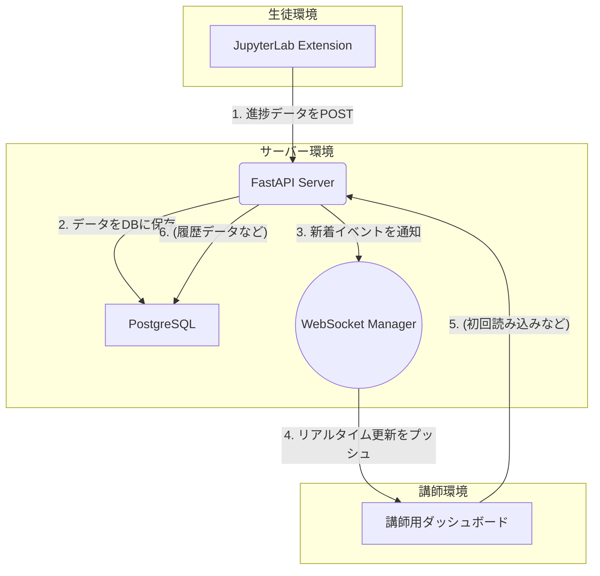

# リアルタイム進捗確認のためのDBアーキテクチャガイド

このドキュメントでは、200人以上の生徒の学習進捗をリアルタイムで確認するための、スケーラブルなデータベースアーキテクチャについて解説します。

## 1. 課題：なぜPostgreSQLだけでは不十分か？

PostgreSQLは信頼性の高い素晴らしいデータベースですが、リアルタイムダッシュボードの要求を単体で満たそうとすると、以下の課題が発生する可能性があります。

- **高頻度なポーリング**: 講師のダッシュボードがリアルタイム性を担保するために、数秒おきにAPIへデータ更新を問い合わせる必要があります。講師が10人いれば、常に数十の問い合わせがサーバーに送られ、その都度データベースへのクエリが発生します。
- **パフォーマンスの低下**: 生徒数が増え、データが蓄積されると、ダッシュボード表示のためのクエリ（例：「全生徒の最新の進捗状況を一覧で取得」）が複雑化・低速化し、システム全体の応答性が悪化する可能性があります。

## 2. 推奨アーキテクチャ：PostgreSQL + WebSocket

この課題を解決するため、PostgreSQLを「永続的なデータストア」として利用しつつ、リアルタイム通知の責務を **WebSocket** に分離するアーキテクチャを推奨します。

### 各コンポーネントの役割

1.  **FastAPI Server (データ受信)**: 生徒の拡張機能から `POST /student-progress` でデータを受け取ります。

2.  **PostgreSQL (永続化層)**: 受け取ったデータを確実に保存します。ここは「信頼できる唯一の情報源(Source of Truth)」となります。複雑な集計や過去のデータ分析もここに対して行います。

3.  **WebSocket Manager (リアルタイム通知層)**: FastAPIのWebSocketサポート機能を利用して実装します。データを受け取った後、接続されている講師のダッシュボード（クライアント）に、新しい進捗データを「プッシュ」通知します。

4.  **講師用ダッシュボード (フロントエンド)**: アプリケーションを開いた際に、まず通常のAPI (`GET /api/class/summary` など) を叩いて現在の全体状況を取得します。その後、WebSocket接続を確立し、サーバーからのプッシュ通知を待ち受けます。新しいデータが届けば、画面をリアルタイムに更新します。

## 3. このアーキテクチャの利点

- **リアルタイム性の向上**: ポーリング方式と異なり、データが発生した瞬間にダッシュボードが更新されるため、真のリアルタイム体験を提供できます。
- **スケーラビリティ**: 講師のダッシュボードからの読み取り負荷がデータベースに直接かかりません。WebSocket接続はメモリを消費しますが、データベースへのクエリ負荷に比べればはるかに軽量です。
- **責務の分離**: データの永続化（PostgreSQL）とリアルタイム通知（WebSocket）の役割が明確に分離され、コードの保守性や拡張性が向上します。

## 4. 実装ステップ

1.  **FastAPIにWebSocketエンドポイントを追加**: `/ws/connect` のようなエンドポイントを作成し、講師ダッシュボードからの接続を管理します。
2.  **データ受信処理の変更**: `POST /student-progress` の処理の最後に、受け取ったデータをWebSocket Manager経由で接続中の全クライアントにブロードキャストする処理を追加します。
3.  **ダッシュボードの実装**: フロントエンド側でWebSocket接続を確立し、サーバーからのメッセージを待ち受けるロジックを実装します。

この構成により、200人規模はもちろん、さらに多くの生徒の進捗を効率的かつリアルタイムに追跡する堅牢なシステムを構築できます。

## 5. さらなるスケーラビリティに向けて

このPostgreSQL + WebSocketの構成は非常に有効ですが、さらに大規模なシステムや、より高度な分析要件に対応するためには、RedisやInfluxDBといった他のデータベースを組み合わせたハイブリッドアーキテクチャも考えられます。

詳細な比較と、より高度な構成例については、[DB技術選定ガイド：PostgreSQL vs Redis vs InfluxDB](./DATABASE_COMPARISON.md) を参照してください。
