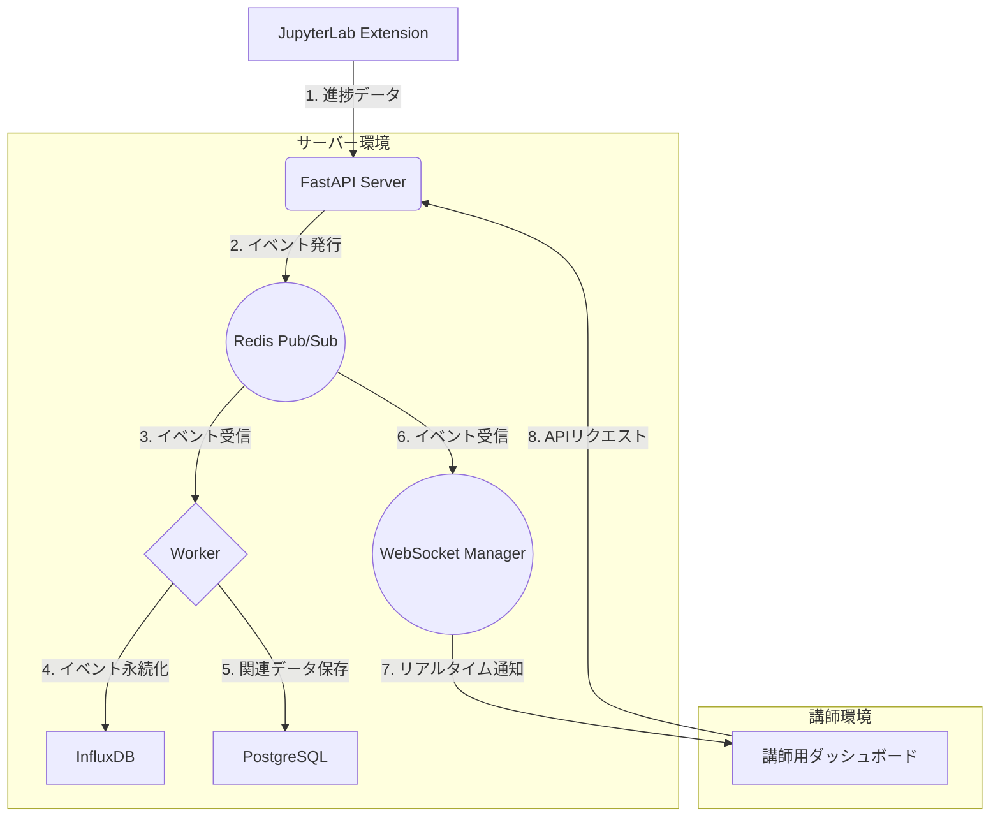

# DB技術選定ガイド：PostgreSQL vs Redis vs InfluxDB

このドキュメントでは、リアルタイム学習分析プラットフォームにおけるデータベース技術の選定について、PostgreSQL、Redis、InfluxDBを比較し、ベストプラクティスを提案します。

## 1. 各データベースの特性比較

| 特性         | PostgreSQL                                 | Redis                                                               | InfluxDB                                                     |
| :----------- | :----------------------------------------- | :------------------------------------------------------------------ | :----------------------------------------------------------- |
| **種類**     | リレーショナルデータベース (RDB)           | インメモリ Key-Valueストア                                          | 時系列データベース (TSDB)                                    |
| **得意なこと** | 構造化されたデータの永続化、複雑なクエリ   | 超高速な読み書き、キャッシュ、Pub/Subメッセージング                 | タイムスタンプ付きデータの超高速な書き込みと集計             |
| **データモデル** | テーブル（行と列）                         | Key-Value, Lists, Hashes, Setsなど                                  | Measurement, Tags, Fields, Timestamp                         |
| **主な用途** | 信頼できる唯一の情報源 (Source of Truth)   | リアルタイム通知、セッション管理、リーダーボード、キャッシュ        | IoTセンサーデータ、モニタリング、ログ、イベントストリーム      |
| **このPJでは** | 生徒情報や最終成績など、関連性の高いデータを保存 | **リアルタイム通知の中継役 (Pub/Sub)**、ダッシュボード用の**一時データ置き場** | **全生徒の操作ログ（イベントストリーム）**のメイン保存先       |

## 2. ベストプラクティス：ハイブリッドアーキテクチャ

単一のデータベースで全ての要求を満たすのではなく、それぞれのツールの長所を活かし、短所を補い合うハイブリッドアーキテクチャを強く推奨します。

### 3. アーキテクチャの解説

1.  **データ受信 (FastAPI)**: FastAPIサーバーは生徒からのデータを受け取ることに専念します。重い処理は行わず、すぐにレスポンスを返します。

2.  **イベント発行 (Redis Pub/Sub)**: FastAPIは受け取ったデータを即座にRedisのPub/Subチャネルに発行（Publish）します。これにより、後続の処理を非同期に実行でき、サーバーの応答性が劇的に向上します。Redisはメッセージングの中継役（ブローカー）として機能します。

3.  **非同期処理 (Worker)**: Celeryなどで実装された別プロセスのWorkerが、Redisのチャネルを購読（Subscribe）し、新しいイベントデータを受け取ります。

4.  **時系列データ保存 (InfluxDB)**: Workerは受け取ったイベントデータを**InfluxDB**に書き込みます。InfluxDBは生徒の操作ログのような時系列データの大量書き込みと、時間範囲を指定した高速な集計（例：「過去5分間のエラー数」）に最適化されています。

5.  **リレーショナルデータ保存 (PostgreSQL)**: Workerは、必要に応じて生徒のマスター情報やコース情報など、関連性が重要なデータを**PostgreSQL**に保存・更新します。こちらは「信頼できる唯一の情報源」として機能します。

6.  **リアルタイム通知 (WebSocket Manager)**: WebSocketを管理するコンポーネントもRedisのチャネルを購読し、新しいイベントを即座に講師のダッシュボードにプッシュ通知します。

7.  **ダッシュボード表示**: 講師のダッシュボードは、WebSocketでリアルタイム更新を受け取ります。過去のデータ分析や複雑なレポートが必要な場合は、FastAPIのAPIを呼び出し、FastAPIがリクエストに応じてInfluxDBやPostgreSQLからデータを取得して返します。

### 4. この構成のメリット

- **高い応答性とスケーラビリティ**: 受信処理と永続化処理をRedisを介して非同期化することで、大量の書き込みリクエストを捌けます。
- **役割の明確化**: 各データベースが得意な処理に専念するため、パフォーマンスと保守性が向上します。
- **柔軟なデータ活用**: リアルタイム分析はInfluxDB、構造的なデータ管理はPostgreSQLと、用途に応じた最適なデータベースに問い合わせることができます。
