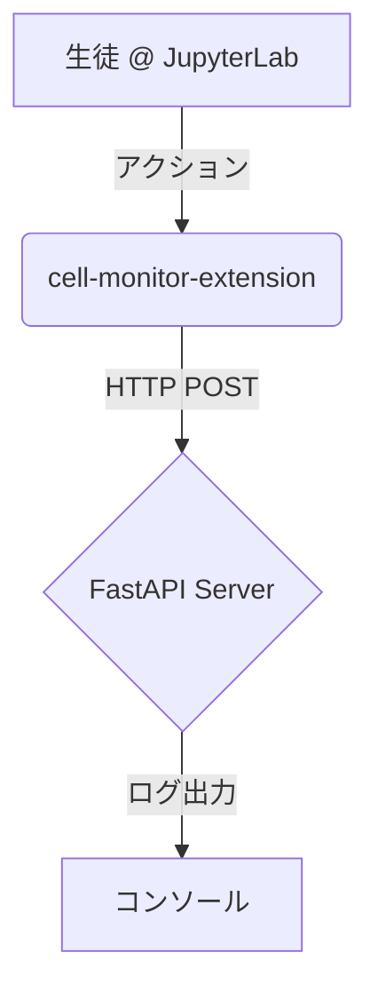

# プロジェクト説明書

## 1. 概要

このプロジェクトは、JupyterLab環境でPython教育コンテンツを利用する生徒の学習進捗をリアルタイムで追跡・分析するためのシステムです。

JupyterLab拡張機能がノートブック上での生徒のアクティビティ（セルの実行、ノートブックの開閉など）を検知し、その情報をバックエンドのFastAPIサーバーに送信します。収集されたデータは、教育者が生徒の理解度を把握したり、つまずいている箇所を特定したりするのに役立ちます。

## 2. アーキテクチャ

システムは主に3つのコンポーネントで構成されています。

- **JupyterLab拡張機能 (`cell-monitor-extension`)**: TypeScriptで開発されたフロントエンドコンポーネント。生徒のJupyterLab上でのアクションを監視し、データを収集します。
- **FastAPIサーバー (`fastapi_server`)**: Pythonで構築されたバックエンドサーバー。拡張機能から送信されたデータを受け取り、処理します。
- **Docker**: `docker-compose.yml` を使用して、上記2つのコンポーネントを連携させた開発・実行環境を構築します。



## 3. データフロー

1.  **イベント発生**: 生徒がJupyterLabでセルを実行、ノートブックを開く・保存・閉じるといった操作を行います。
2.  **データ収集**: `cell-monitor-extension/src/index.ts` 内のイベントリスナーがこれらの操作を検知し、`IStudentProgressData` 形式でイベント詳細（ユーザーID, セルの中身, 実行結果など）をオブジェクトとして生成します。
3.  **データ送信**: 生成されたデータは、HTTP POSTリクエストでFastAPIサーバーの `/student-progress` エンドポイントに送信されます。
4.  **データ受信・処理**: FastAPIサーバー (`fastapi_server/main.py`) はデータを受け取り、現在はコンソールにログとして出力します。

## 4. 実行方法

プロジェクトのルートディレクトリで以下のコマンドを実行することで、JupyterLabとFastAPIサーバーを起動します。

```bash
docker-compose up --build
```

- JupyterLab: `http://localhost:8888` (トークン: `easy`)
- FastAPIサーバー: `http://localhost:8000`

## 5. 設定

JupyterLab拡張機能の動作は、JupyterLabの `Settings` > `Advanced Settings Editor` > `Cell Monitor` から変更できます。

- **serverUrl**: データ送信先APIサーバーのURL (デフォルト: `http://localhost:8000/student-progress`)
- **userId**: ユーザーを識別するためのID（空の場合は自動生成）
- **userName**: ユーザーの表示名 (デフォルト: `Anonymous`)

## 6. 今後の開発方針（ベストプラクティス）

現状のシステムをより堅牢で実用的なものにするための提案です。

1.  **データベースの導入**:
    - 現在は受信データをログ出力していてだけですが、これをデータベース（例: PostgreSQL, SQLite）に永続化するべきです。
    - `fastapi_server` にて、SQLAlchemyなどのORMを導入し、受信した `StudentProgressData` をテーブルに保存する処理を追加します。大規模なリアルタイム性を考慮したアーキテクチャについては、[リアルタイム進捗確認のためのDBアーキテクチャガイド](./DATABASE_ARCHITECTURE.md) を参照してください。さらに高度な技術（Redis, InfluxDB）との比較については、[DB技術選定ガイド](./DATABASE_COMPARISON.md)が参考になります。

2.  **データ分析・可視化機能の追加**:
    - 保存したデータを分析し、教育者向けのダッシュボードを作成します。詳細な分析・可視化の手法については、[学習進捗データの分析と可視化ガイド](./ANALYSIS_GUIDE.md) を参照してください。
    - FastAPIに新しいエンドポイントを追加し、生徒ごとの進捗状況やクラス全体の傾向などを返すAPIを実装します。
    - フロントエンド側で、このAPIを叩いて結果を可視化するUIを構築します（例: Chart.js, D3.jsなどを利用）。

3.  **認証・認可機能の強化**:
    - 現在、APIは誰でもアクセス可能な状態です。JupyterLabからのリクエストであることを確認するためのAPIキーや、OAuthなどの認証メカニズムを導入します。
    - `JUPYTER_TOKEN` も、より安全なものに変更し、本番環境では環境変数などから読み込むようにします。

4.  **テストの拡充**:
    - `fastapi_server` に `pytest` を用いたAPIの単体テスト・結合テストを追加します。
    - `cell-monitor-extension` にJestなどを用いたフロントエンドの単体テストを追加します。

5.  **設定の柔軟性向上**:
    - サーバーサイドでどのイベントを収集するか（例: `notebook_saved` は不要など）を選択できるような設定を追加します。

これらのステップを段階的に進めることで、より価値の高い学習分析プラットフォームへと発展させることができます。
