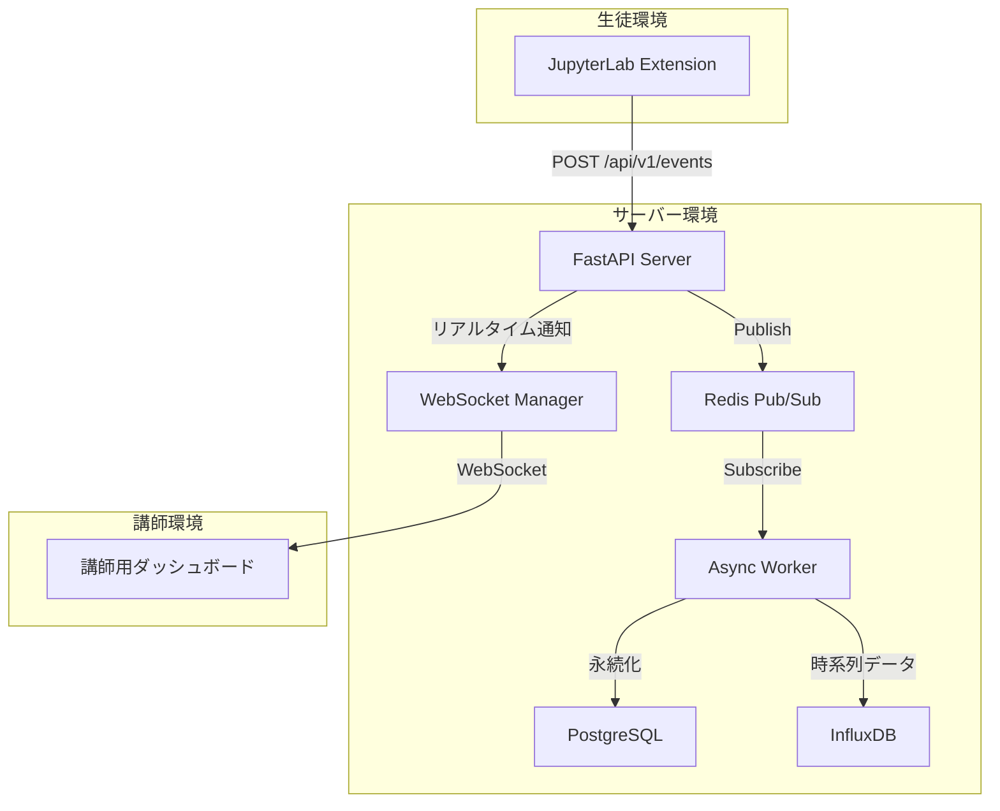

# JupyterLab Cell Monitor Extension - AI駆動開発プロジェクト

> **バージョン**: 2.0.0
> **最終更新日**: 2025-01-18
> **開発手法**: AI駆動開発 (AI-Driven Development)

## 🎯 プロジェクト概要

このプロジェクトは、JupyterLab環境でPython教育コンテンツを利用する生徒の学習進捗をリアルタイムで追跡・分析するためのシステムです。AI駆動開発の原則に基づき、段階的かつテスト駆動で開発を進めています。

### 主要コンポーネント

- **JupyterLab拡張機能** (`cell-monitor-extension`): TypeScriptで開発されたフロントエンドコンポーネント
- **FastAPIサーバー** (`fastapi_server`): Pythonで構築されたバックエンドサーバー
- **データベース層**: PostgreSQL（マスターデータ）+ InfluxDB（時系列データ）+ Redis（リアルタイム通信）
- **ダッシュボード**: 講師向けリアルタイム可視化インターフェース

## 🏗️ アーキテクチャ概要



## 🚀 クイックスタート

### 前提条件

- Docker & Docker Compose
- Node.js 18+ (開発時)
- Python 3.11+ (開発時)

### 環境起動

```bash
# プロジェクトルートで実行
docker-compose up --build

# アクセス先
# JupyterLab: http://localhost:8888 (token: easy)
# FastAPI: http://localhost:8000
# ダッシュボード: http://localhost:3000
```

### 拡張機能設定

JupyterLabの `Settings` > `Advanced Settings Editor` > `Cell Monitor` で以下を設定：

```json
{
  "serverUrl": "http://fastapi:8000/api/v1/events",
  "userId": "",
  "userName": "Anonymous"
}
```

## 📚 ドキュメント構成

### 基本ドキュメント
- [アーキテクチャ設計](./architecture/README.md) - システム全体の設計思想
- [開発計画](./development/DEVELOPMENT_PLAN.md) - フェーズ別開発ロードマップ
- [API仕様](./api/README.md) - エンドポイント仕様書

### 開発者向け
- [開発環境構築](./development/SETUP.md) - 開発環境のセットアップ
- [テスト戦略](./testing/README.md) - テスト実行とCI/CD
- [トラブルシューティング](./troubleshooting/README.md) - 問題解決ガイド

### AI駆動開発
- [AI協調開発ガイド](./ai-driven/README.md) - AIとの効果的な協働方法
- [プロンプトエンジニアリング](./ai-driven/PROMPTING.md) - 開発用プロンプト集
- [コード生成戦略](./ai-driven/CODE_GENERATION.md) - AI活用のベストプラクティス

### 分析・可視化
- [データ分析ガイド](./analysis/README.md) - 学習進捗データの分析手法
- [ダッシュボード仕様](./dashboard/README.md) - 可視化インターフェース

## 🎯 現在の開発状況

### ✅ 完了済み
- [x] JupyterLab拡張機能の基本実装
- [x] 統一イベントエンドポイント (`/api/v1/events`)
- [x] Docker環境での開発・実行環境
- [x] 基本的なデータ収集機能

### 🚧 進行中
- [ ] 非同期Worker実装とDB永続化
- [ ] WebSocketによるリアルタイム通知
- [ ] 講師用ダッシュボードのプロトタイプ

### 📋 今後の計画
- [ ] 高度な分析機能（学習パターン分析）
- [ ] 認証・認可システム
- [ ] スケーラビリティ向上（マイクロサービス化）
- [ ] AI支援による自動インサイト生成

## 🤝 AI駆動開発の原則

このプロジェクトでは以下の原則に基づいて開発を進めています：

1. **インクリメンタルな指示**: 段階的な機能実装
2. **テスト駆動開発**: AIによるテストコード生成と品質保証
3. **ドキュメント同期**: コード変更と同時のドキュメント更新
4. **継続的改善**: AIフィードバックによる設計改善

## 📞 サポート

- **Issue報告**: [GitHub Issues](https://github.com/your-repo/issues)
- **開発相談**: [Discussions](https://github.com/your-repo/discussions)
- **AI駆動開発**: [AI協調開発ガイド](./ai-driven/README.md)を参照

---

**注意**: このプロジェクトはAI駆動開発の実践例として構築されています。各ドキュメントには、AIとの協働における具体的な手法やベストプラクティスが含まれています。
