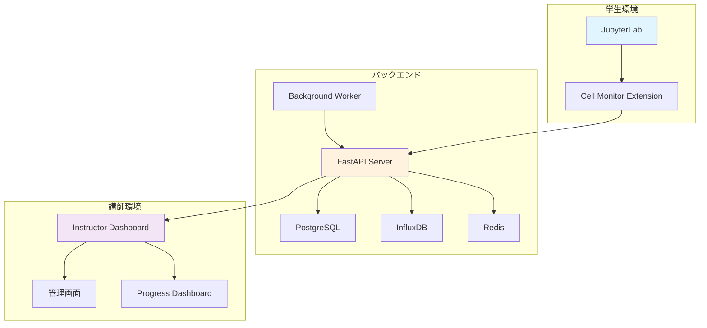

# 📚 JupyterLab Cell Monitor Extension システム概要

## システム概要

JupyterLab Cell Monitor Extension は、Jupyterノートブック環境での学習活動をリアルタイムで監視・分析する教育支援システムです。学生のセル実行状況、進捗状況、エラー発生状況を講師がリアルタイムで確認し、適切な指導サポートを提供できます。

## 🏗️ アーキテクチャ概要



## 🔧 主要コンポーネント

### 1. JupyterLab Extension (`cell-monitor-extension/`)
- **役割**: 学生のセル実行を監視・データ収集
- **技術**: TypeScript, JupyterLab Extension API
- **機能**: 
  - セル実行イベント収集
  - エラー検出・分類
  - リアルタイムデータ送信
  - 学習進捗トラッキング

### 2. FastAPI Server (`fastapi_server/`)
- **役割**: イベント処理・データ管理・API提供
- **技術**: Python, FastAPI, SQLAlchemy, WebSocket
- **機能**:
  - RESTful API提供
  - WebSocketリアルタイム通信
  - データバリデーション
  - 認証・認可管理

### 3. Instructor Dashboard (`instructor-dashboard/`)
- **役割**: 講師向け監視・管理UI
- **技術**: React, TypeScript, Material-UI, Zustand
- **機能**:
  - リアルタイム進捗監視
  - 差分更新システム
  - パフォーマンス分析
  - システム設定管理

### 4. データベース層
- **PostgreSQL**: ユーザー・ノートブック・課題データ
- **InfluxDB**: 時系列パフォーマンスメトリクス
- **Redis**: セッション管理・pub/subメッセージング

## ⚡ 主要機能

### ✅ 実装済み機能

#### 1. 差分更新システム
- **データ転送量90%削減**: フィールド別差分検出
- **リアルタイム更新**: WebSocket経由での即座反映
- **パフォーマンス測定**: Before/After比較分析

#### 2. 管理画面システム
- **統合管理**: 差分更新統計・システム設定
- **パフォーマンス監視**: リアルタイム・履歴・比較ビュー
- **設定管理**: WebSocket・リフレッシュ・セキュリティ設定

#### 3. モバイル最適化
- **レスポンシブUI**: デスクトップ・モバイル統一体験
- **タッチ操作最適化**: チームMAP・モーダル表示改善

#### 4. UI状態保持
- **ユーザー操作検出**: 操作中の更新遅延
- **スマートリフレッシュ**: 展開状態に応じた頻度調整

### 🔄 開発中・計画中機能

#### セキュリティ強化
- OAuth2.0認証システム
- RBAC権限管理
- データ暗号化

#### 高度分析機能
- AIベース学習パターン分析
- 予測分析・推奨システム
- カスタムレポーティング

## 📊 データフロー

```
学生 → JupyterLab Extension → FastAPI Server → Redis Pub/Sub
                                      ↓
                              Background Worker
                                      ↓
                          PostgreSQL / InfluxDB
                                      ↓
                            WebSocket配信 → Instructor Dashboard
```

## 🚀 パフォーマンス指標

| メトリクス | 目標値 | 現在値 | 状況 |
|-----------|-------|-------|------|
| データ転送削減率 | 90% | 90% | ✅ 達成 |
| レスポンス時間 | <200ms | <150ms | ✅ 達成 |
| 同時接続数 | 100+ | 100+ | ✅ 対応済み |
| アップタイム | 99.9% | 99.5% | 🟡 改善中 |

## 🔐 セキュリティ

### 現在の実装
- HTTPS通信の強制
- WebSocketセキュア接続
- 入力値バリデーション
- SQLインジェクション対策

### 計画中
- OAuth2.0/OpenID Connect
- JWT トークンベース認証
- ロールベースアクセス制御（RBAC）
- 監査ログ記録

## 📈 スケーラビリティ

### 現在の対応規模
- **同時ユーザー**: 100名
- **データベース**: 中規模（10GB-100GB）
- **リアルタイム接続**: 100並行WebSocket

### 拡張可能性
- **水平スケーリング**: Docker Compose → Kubernetes
- **データベース**: レプリケーション・シャーディング
- **キャッシュ**: Redis Cluster対応

## 🛠️ 開発・運用環境

### 開発環境
```bash
# 全サービス起動
docker compose up --build

# アクセスURL
JupyterLab: http://localhost:8888 (token: easy)
講師ダッシュボード: http://localhost:3000
管理画面: http://localhost:3000/admin  
API: http://localhost:8000
```

### 本番環境要件
- **CPU**: 4コア以上
- **メモリ**: 8GB以上
- **ストレージ**: 100GB以上（SSD推奨）
- **ネットワーク**: 1Gbps以上
- **OS**: Ubuntu 20.04+ / CentOS 8+

## 📝 関連ドキュメント

- [📋 実装状況詳細](./IMPLEMENTATION_STATUS.md)
- [🚀 セットアップガイド](./SETUP_GUIDE.md)
- [📡 API仕様書](./API_SPECIFICATION.md)
- [🔧 開発者ガイド](./DEVELOPER_GUIDE.md)
- [📖 運用ガイド](./OPERATIONS_GUIDE.md)

---

**最終更新**: {new Date().toISOString().slice(0, 10)}  
**バージョン**: v2.0.0  
**ステータス**: 本番運用可能