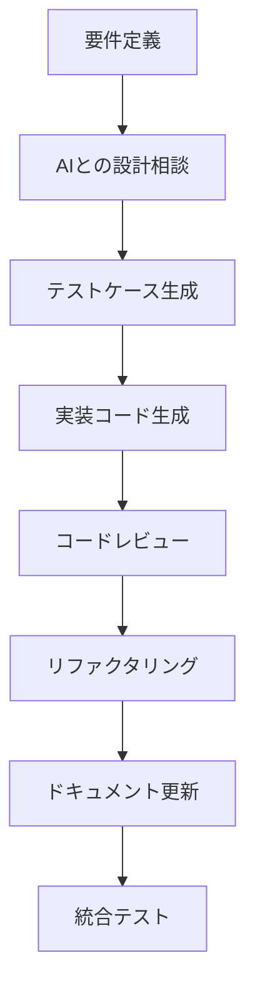
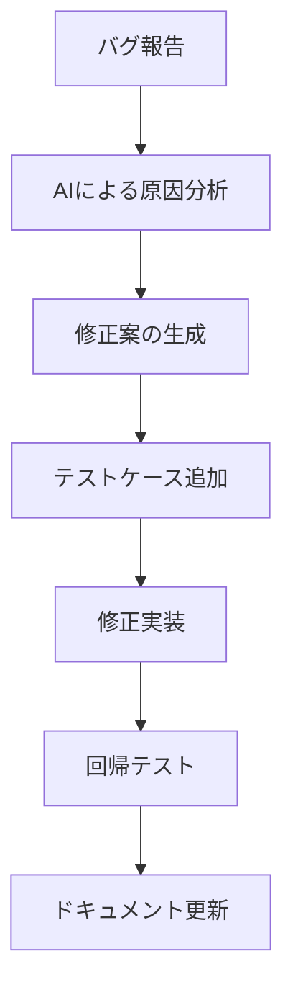

# AI駆動開発ガイド

> **開発手法**: AI協調開発による効率的なソフトウェア開発
> **最終更新日**: 2025-01-18

## 🎯 AI駆動開発の基本原則

### 1. AIとの効果的なコラボレーション

#### インクリメンタルな指示
- **小さな単位での開発**: 一度に大量の機能ではなく、段階的な実装を心がける
- **明確な目標設定**: 各開発フェーズの具体的な成果物を定義
- **フィードバックループ**: 生成結果を評価し、具体的な改善点をAIに伝える

#### コンテキストの明確化
```markdown
# 良い指示の例
現在のFastAPIサーバーに、PostgreSQLへの学習セッションデータ保存機能を追加してください。
- 対象ファイル: fastapi_server/main.py
- 使用するORM: SQLAlchemy
- テーブル: learning_sessions
- 必要なフィールド: user_id, notebook_id, started_at, cell_executions
```

### 2. プロンプトエンジニアリング戦略

#### 構造化されたプロンプト
```
目的: [何を達成したいか]
コンテキスト: [現在の状況、関連ファイル、依存関係]
制約条件: [技術的制約、パフォーマンス要件]
期待する出力: [具体的な成果物の形式]
```

#### 具体例の提示
- 期待する出力形式の例を示す
- コーディング規約やスタイルガイドを含める
- エラーハンドリングの方針を明確にする

## 🔧 コード生成の最適化

### 1. 小さな単位での生成
```python
# ❌ 避けるべき: 大きすぎる単位
"FastAPIサーバー全体を作り直してください"

# ✅ 推奨: 適切な単位
"EventData モデルにバリデーション機能を追加してください"
```

### 2. 一貫したスタイル
```python
# プロジェクト固有のコーディング規約
class EventData(BaseModel):
    """イベントデータモデル

    Args:
        event_type: イベントの種類
        user_id: ユーザーID
        timestamp: イベント発生時刻
    """
    event_type: str = Field(..., description="イベントタイプ")
    user_id: str = Field(..., description="ユーザーID")
    timestamp: datetime = Field(default_factory=datetime.now)
```

### 3. ステートフル開発
- AIとの会話履歴を活用
- 継続的な改善とリファクタリング
- 設計決定の記録と共有

## 📋 AIによるドキュメント作成

### 1. ドキュメント生成戦略

#### 目的明確化
```markdown
# ドキュメント作成指示の例
対象読者: 新規参加の開発者
目的: プロジェクトのセットアップから初回コントリビューションまでの手順
形式: ステップバイステップガイド
含めるべき内容: 環境構築、テスト実行、開発フロー
```

#### スケルトンファースト
1. 目次構造を先に生成
2. 各セクションの概要を作成
3. 詳細内容を段階的に追加

### 2. 構造とフォーマット

#### マークダウン標準
- CommonMark準拠のマークダウン形式
- 最大3階層までの見出し構造（H1→H2→H3）
- コードブロック、図表、引用の効果的な配置

#### メタデータ重視
```markdown
> **バージョン**: 1.0.0
> **最終更新日**: 2025-01-18
> **対象読者**: 開発者
> **前提知識**: Python, FastAPI, Docker
```

## 🧪 AI駆動テスト戦略

### 1. テスト先行開発

#### AIによるテストケース生成
```python
# テスト要件を明確にした指示
"""
以下の関数のテストケースを生成してください:
- 正常系: 有効なイベントデータでの処理
- 異常系: 無効なデータ、ネットワークエラー
- 境界値: 最大・最小値での動作
- モック: 外部依存関係のモック化
"""

def test_event_processing():
    # AIが生成するテストコード
    pass
```

#### テスト駆動開発サイクル
1. **テスト仕様生成**: AIによる要件からのテストコード生成
2. **実装サポート**: テスト仕様を満たすコードをAIが提案
3. **リファクタリング支援**: テストを維持したままコード改善

### 2. 品質保証の自動化

#### AIコードレビュー
```python
# コードレビュー観点の指定
"""
以下の観点でコードレビューを実施してください:
1. セキュリティ: SQLインジェクション、XSS対策
2. パフォーマンス: N+1問題、メモリリーク
3. 可読性: 命名規則、コメント、構造
4. テスタビリティ: 依存関係の注入、モック可能性
"""
```

#### 継続的改善
- AIからのフィードバックを開発プロセスに組み込み
- 技術的負債の特定と解決提案
- コードヘルスの継続的監視

## 🤝 AI協調開発パターン

### 1. ペアプログラミングパターン

#### ナビゲーター/ドライバー
```markdown
人間（ナビゲーター）の役割:
- 要件定義と設計方針の決定
- ビジネスロジックの検証
- アーキテクチャ決定

AI（ドライバー）の役割:
- コード実装とテスト生成
- ドキュメント作成
- リファクタリング提案
```

#### コードレビューサイクル
1. AIが初期実装を生成
2. 人間がレビューとフィードバック
3. AIが修正と改善を実施
4. 品質基準を満たすまで反復

### 2. 高度なAI活用テクニック

#### チェーンオブソート
```markdown
複雑な問題の分解例:
1. 大問題: "リアルタイムダッシュボードの実装"
2. 小問題に分解:
   - WebSocket接続管理
   - データ集計API
   - フロントエンド可視化
   - パフォーマンス最適化
3. 各小問題をAIで解決
```

#### セルフレビュー
```python
# AIに自身の出力を改善させる
"""
先ほど生成したコードを以下の観点で改善してください:
1. エラーハンドリングの強化
2. ログ出力の追加
3. 型ヒントの完全化
4. ドキュメント文字列の追加
"""
```

## 📊 効果測定とKPI

### 1. 開発効率の指標
- **コード生成速度**: 機能実装にかかる時間
- **バグ発生率**: AIが生成したコードの品質
- **テストカバレッジ**: 自動生成されたテストの網羅性
- **ドキュメント完成度**: 生成ドキュメントの有用性

### 2. 品質指標
- **コードレビュー時間**: 人間によるレビュー時間の短縮
- **技術的負債**: AIによる負債検出と解決提案
- **保守性**: コードの理解しやすさと変更容易性

## 🔄 継続的改善プロセス

### 1. AIフィードバックの活用
```python
# 定期的な品質評価
def evaluate_ai_generated_code():
    """AI生成コードの品質評価"""
    metrics = {
        "complexity": calculate_cyclomatic_complexity(),
        "maintainability": assess_maintainability_index(),
        "test_coverage": get_test_coverage_percentage(),
        "documentation": evaluate_documentation_quality()
    }
    return metrics
```

### 2. 学習と適応
- AIの提案パターンの分析
- 成功事例の蓄積と共有
- 失敗パターンの特定と回避策

## 🛠️ 実践的なワークフロー

### 1. 新機能開発フロー


### 2. バグ修正フロー


---

## 📚 関連ドキュメント

- [プロンプトエンジニアリング](./PROMPTING.md)
- [コード生成戦略](./CODE_GENERATION.md)
- [テスト自動化](../testing/AI_TESTING.md)
- [品質保証](../development/QUALITY_ASSURANCE.md)
