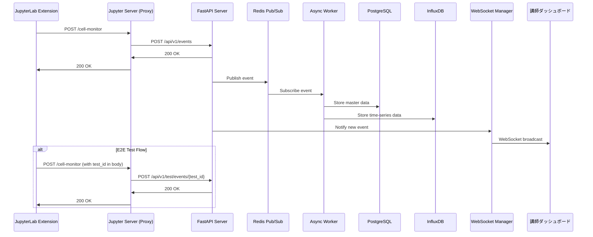

# システムアーキテクチャ設計

> **設計思想**: 単一エンドポイント・イベントタイプによる処理振り分け
> **最終更新日**: 2025-01-18

## 🎯 設計原則

### 1. 単一責任の原則
- **JupyterLab拡張機能**: データ収集と単一エンドポイントへの送信のみ
- **FastAPIサーバー**: イベント受信、処理振り分け、永続化、通知
- **フロントエンドダッシュボード**: データ可視化とユーザーインターフェース

### 2. 疎結合アーキテクチャ
- クライアントは単一のURLにデータを送信
- サーバーが内部でイベントタイプに基づいて処理を振り分け
- 各コンポーネントは独立して開発・デプロイ可能

## 🏗️ システム構成

### コンポーネント間通信

### データフロー設計

1. **イベント収集**: JupyterLab拡張機能が学習活動を監視します。
2. **プロキシ経由の送信**: 収集したデータを、同一オリジン内のJupyterサーバープロキシエンドポイント (`/cell-monitor`) に送信します。これによりブラウザのセキュリティ制約（CSP/CORS）を回避します。
3. **リクエスト転送**: Jupyterサーバーは受け取ったリクエストをFastAPIサーバーの統一エンドポイント (`/api/v1/events`) に転送します。
4. **非同期処理**: FastAPIサーバーはリクエストを受信後、即座にイベントをRedis Pub/Subに発行し、非同期ワーカーがデータベースへの永続化処理を行います。
5. **リアルタイム通知**: イベントはWebSocketを通じて講師ダッシュボードにリアルタイムで通知されます。
6. **データ可視化**: 講師ダッシュボードで学習状況が分析・表示されます。

## 🗄️ データベース設計

### PostgreSQL（マスターデータ）
- ユーザー情報
- ノートブック情報
- セッション管理
- 関係性データ

### InfluxDB（時系列データ）
- セル実行履歴
- パフォーマンスメトリクス
- 学習進捗の時系列変化
- エラー発生パターン

### Redis（リアルタイム通信）
- Pub/Subによるイベント伝搬
- WebSocket接続管理
- 一時的なセッションデータ

## 🔧 技術スタック

### フロントエンド
- **JupyterLab Extension**: TypeScript, JupyterLab APIs
- **講師ダッシュボード**: React/Vue.js, WebSocket, Chart.js

### バックエンド
- **API Server**: FastAPI, Python 3.11+
- **Async Worker**: asyncio, Redis client
- **WebSocket**: FastAPI WebSocket support

### インフラストラクチャ
- **コンテナ化**: Docker, Docker Compose
- **データベース**: PostgreSQL 15, InfluxDB 2.x, Redis 7
- **監視**: Prometheus, Grafana (将来実装)

## 🚀 スケーラビリティ考慮

### 水平スケーリング
- FastAPIサーバーの複数インスタンス対応
- Redis Clusterによる分散処理
- ロードバランサーによる負荷分散

### パフォーマンス最適化
- 非同期処理による応答速度向上
- データベースインデックス最適化
- WebSocket接続プーリング

## 🔒 セキュリティ設計

### 認証・認可
- JWT トークンベース認証
- ロールベースアクセス制御（RBAC）
- API キーによるサービス間認証

### データ保護
- 個人情報の暗号化
- 通信のTLS暗号化
- データベースアクセス制御

## 📊 監視・ログ設計

### アプリケーション監視
- ヘルスチェックエンドポイント
- メトリクス収集（Prometheus）
- 分散トレーシング

### ログ管理
- 構造化ログ（JSON形式）
- ログレベル管理
- 集約ログ分析

## 🔄 CI/CD パイプライン

### 自動化プロセス
- コード品質チェック（linting, formatting）
- 自動テスト実行（単体・統合・E2E）
- セキュリティスキャン
- 自動デプロイ

### 環境管理
- 開発環境（Docker Compose）
- ステージング環境（Kubernetes）
- 本番環境（クラウドネイティブ）

---

## 📚 関連ドキュメント

- [データベース詳細設計](./DATABASE_ARCHITECTURE.md)
- [API仕様書](../api/README.md)
- [セキュリティガイド](./SECURITY.md)
- [パフォーマンス最適化](./PERFORMANCE.md)
