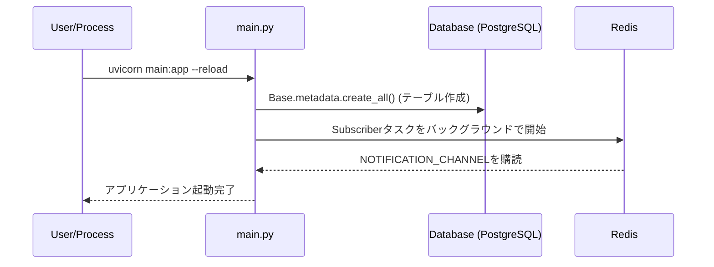
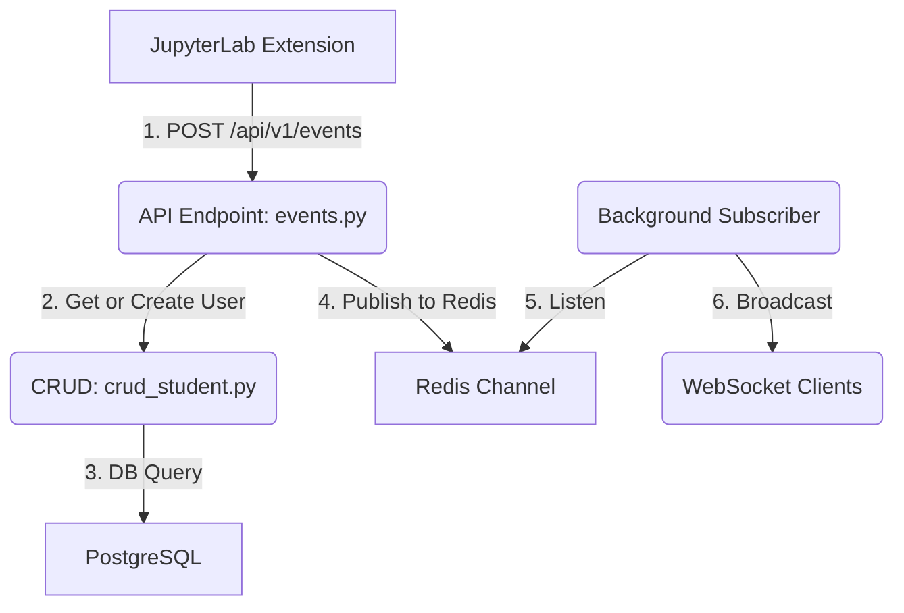

# システムアーキテクチャ概要

**バージョン**: 1.0.0
**最終更新日**: 2025-07-19

## 1. 概要

このドキュメントは、`fastapi_server` の技術的な構造、コンポーネントの役割、およびデータフローについて解説します。プロジェクト全体の技術的な全体像を理解するための主要な資料です。

## 2. ディレクトリ構造とコンポーネントの役割

サーバーサイドアプリケーションは、責務の分離の原則に基づき、以下のディレクトリ構造で構成されています。

```
fastapi_server/
├── api/                  # APIエンドポイントの定義
│   ├── endpoints/        # 各機能のエンドポイントロジック
│   └── api.py            # APIルーターの集約
├── core/                 # アプリケーションのコア設定
│   ├── config.py         # 環境変数などの設定管理
│   └── connection_manager.py # WebSocket接続管理
├── crud/                 # DBのCRUD操作をカプセル化
│   └── crud_student.py   # 学生（ユーザー）情報の操作
├── db/                   # データベース関連
│   ├── models.py         # SQLAlchemyのテーブルモデル定義
│   ├── session.py        # DBセッションの生成
│   ├── redis_client.py   # Redisクライアント
│   └── ...
├── schemas/              # Pydanticによるデータ検証スキーマ
├── worker/               # (将来的な)非同期バックグラウンド処理
├── tests/                # 各種テストコード
│   ├── unit/
│   ├── integration/
│   └── e2e/
├── main.py               # FastAPIアプリケーションのエントリーポイント
└── requirements.txt      # Pythonの依存パッケージリスト
```

## 3. アプリケーションの起動シーケンス

アプリケーションは `main.py` から起動され、以下のシーケンスで初期化されます。



1.  **FastAPIアプリケーション**が初期化されます。
2.  **`lifespan` イベントハンドラ**が起動します。
3.  **データベース接続**が確立され、SQLAlchemyで定義された全てのテーブルが存在しない場合は自動的に作成されます。
4.  **Redis Subscriber**がバックグラウンドタスクとして起動し、`NOTIFICATION_CHANNEL` の購読を開始します。これにより、リアルタイム通知の準備が整います。

## 4. 主要なデータフロー: セル実行イベント

ユーザーがJupyterLabでセルを実行した際の、代表的なデータフローは以下の通りです。



1.  **イベント受信**: JupyterLab拡張機能から送信されたイベントデータが、`events.py` のエンドポイントで受信されます。
2.  **ユーザー確認**: `crud_student.py` を通じて、イベントを送信したユーザーがデータベースに存在するかを確認します。存在しない場合は新規に作成します。
3.  **DB永続化**: (イベント内容に応じて) イベントデータがデータベースに保存されます。
4.  **リアルタイム通知発行**: イベント情報がRedisの `NOTIFICATION_CHANNEL` に発行（Publish）されます。
5.  **通知受信**: `main.py` で起動したバックグラウンドタスクが、チャンネルに発行されたメッセージを即座に受信します。
6.  **ブロードキャスト**: 受信したメッセージが、WebSocketで接続している全てのクライアント（例: ダッシュボードUIなど）に一斉に送信されます。
