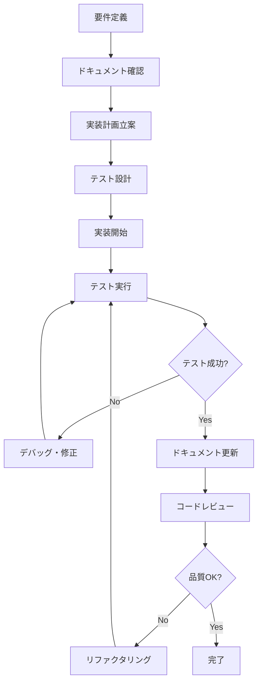

# AI駆動開発ガイド

## 🤖 このガイドの目的

このドキュメントは、AIアシスタント（Claude、ChatGPT、GitHub Copilot等）と協働してJupyterLab Cell Monitor Extensionシステムを開発するための具体的な手順とベストプラクティスを提供します。

## 📋 AI駆動開発の原則

### 1. 段階的実装（Incremental Development）
- 大きな機能を小さなタスクに分解
- 各タスクは独立してテスト可能
- 成功確認後に次のステップへ進行

### 2. ドキュメント駆動開発（Documentation-Driven Development）
- 実装前に仕様をドキュメント化
- AIが参照しやすい形式で構造化
- 実装と同時にドキュメント更新

### 3. テスト駆動開発（Test-Driven Development）
- AIにテストコードを先に生成依頼
- 実装コードはテストをパスするように作成
- リファクタリング時もテストで安全性確保

## 🎯 AI協働開発フローチャート



## 📚 実装時の参照順序

### Phase 1: 情報収集
1. **[実装計画を確認](../implementation-plans/)**: 該当する機能の実装戦略を理解
2. **[実装状況を確認](../implementation-status/)**: 現在の実装レベルと問題点を把握
3. **[既知の問題を確認](../implementation-status/KNOWN_ISSUES.md)**: 回避すべき問題を事前把握

### Phase 2: 設計理解
1. **[システム概要](../overview/SYSTEM_OVERVIEW.md)**: 全体アーキテクチャの理解
2. **[API仕様](../api/)**: インターフェース設計の理解
3. **[データモデル](../api/DATA_MODELS.md)**: データ構造の理解

### Phase 3: 実装準備
1. **[開発環境セットアップ](ENVIRONMENT_SETUP.md)**: ローカル開発環境の構築
2. **[コーディング規約](CODING_STANDARDS.md)**: 品質基準の確認
3. **[テスト戦略](TESTING_GUIDE.md)**: テスト手法の理解

## 🛠️ 具体的なAI協働手順

### 新機能実装の場合

#### Step 1: 要件整理とAIへの依頼

**良い依頼例**:
```
FastAPIでセル実行イベントを受信するエンドポイントを実装してください。

参照ドキュメント:
- implementation-plans/FASTAPI_IMPLEMENTATION_PLAN.md
- api/API_SPECIFICATION.md
- implementation-status/KNOWN_ISSUES.md（データベーススキーマの問題を回避）

要件:
1. POST /api/v1/events エンドポイント
2. 最大100件のバッチ処理対応
3. Pydanticスキーマでバリデーション
4. Redis Pub/Subでワーカーに配信
5. 適切なエラーハンドリング

既存のコード参照:
- fastapi_server/schemas/event.py (EventDataスキーマ)
- fastapi_server/db/redis_client.py (Redis操作)
```

**悪い依頼例**:
```
イベントAPIを作って
```

#### Step 2: 生成されたコードの検証

AIが生成したコードを以下の観点で検証：

1. **ドキュメントとの整合性**:
   ```python
   # 確認: implementation-plans/FASTAPI_IMPLEMENTATION_PLAN.mdの仕様と一致しているか？
   @router.post("/events", status_code=202)  # ✅ 正しいステータスコード
   async def receive_events(events: List[EventData]):  # ✅ 正しいスキーマ使用
   ```

2. **既知の問題の回避**:
   ```python
   # 確認: KNOWN_ISSUES.mdの問題を回避しているか？
   # ❌ 避けるべき: session_id=Noneの設定
   # ✅ 正しい: session_idを適切に処理または除外
   ```

3. **コーディング規約の準拠**:
   ```python
   # 確認: CODING_STANDARDS.mdに従っているか？
   # ✅ 型注釈の使用
   # ✅ docstringの記述
   # ✅ 適切な変数名
   ```

#### Step 3: テストコードの生成依頼

```
上記で実装したイベント受信エンドポイントのテストコードを作成してください。

参照:
- development/TESTING_GUIDE.md
- fastapi_server/tests/api/ (既存のテスト例)

テスト要件:
1. 正常ケース: 単一イベント、複数イベント
2. 異常ケース: 空配列、過多イベント(100件超)、不正なスキーマ
3. Redis接続エラーのモック
4. FastAPIのTestClientを使用

既存のテスト形式を踏襲してください。
```

#### Step 4: 統合テスト実行

```bash
# 1. ユニットテスト実行
pytest fastapi_server/tests/api/test_events.py -v

# 2. 統合テスト実行
pytest fastapi_server/tests/integration/ -v

# 3. 全体テスト実行
pytest fastapi_server/ --cov=fastapi_server
```

### 問題修正の場合

#### Step 1: 問題の特定

```
KNOWN_ISSUES.mdに記載されている「データベーススキーマ不整合エラー」を修正してください。

問題詳細:
- fastapi_server/db/models.py:117のsession_idがNOT NULL制約
- fastapi_server/crud/crud_execution.py:21でNoneを設定している
- 結果: IntegrityError: NOT NULL constraint failed

修正方針:
1. セッション管理機能の実装状況を確認
2. schema修正とmigration作成
3. affected codeの修正
4. テストコード更新

参照:
- implementation-status/FASTAPI_STATUS.md (実装状況)
- fastapi_server/alembic/ (migration files)
```

#### Step 2: 段階的修正

1. **データベーススキーマ修正**:
   ```python
   # models.py の修正依頼
   session_id = Column(Integer, ForeignKey("sessions.id"), nullable=True)
   ```

2. **マイグレーション作成**:
   ```bash
   alembic revision --autogenerate -m "Fix session_id nullable constraint"
   ```

3. **影響範囲の確認と修正**:
   ```python
   # crud_execution.py の修正
   # None値を適切に処理する実装に変更
   ```

## 📝 AIへの効果的な依頼方法

### 良い依頼の構成要素

1. **明確な目的**:
   ```
   目的: JupyterLabから送信されたセル実行イベントをInfluxDBに時系列データとして保存する機能を実装
   ```

2. **具体的な要件**:
   ```
   要件:
   - EventDataスキーマからInfluxDB Pointオブジェクトに変換
   - タグ: userId, eventType, notebook, cellType
   - フィールド: executionTime, hasError, cellContent
   - エラー時のリトライ機能（最大3回、指数バックオフ）
   ```

3. **参照情報**:
   ```
   参照:
   - fastapi_server/schemas/event.py (EventData定義)
   - fastapi_server/db/influxdb_client.py (既存のInfluxDB操作)
   - implementation-plans/FASTAPI_IMPLEMENTATION_PLAN.md (実装戦略)
   ```

4. **制約・注意事項**:
   ```
   制約:
   - KNOWN_ISSUES.mdのInfluxDB設定問題を回避
   - 既存のwrite_progress_event関数との整合性維持
   - パフォーマンス: 1000レコード/分の処理能力
   ```

### 避けるべき依頼方法

❌ **曖昧な依頼**:
```
InfluxDBにデータを保存する機能を作って
```

❌ **情報不足**:
```
エラーが出るので修正して
```

❌ **一度に複雑すぎる依頼**:
```
API、データベース、WebSocket、テストを全部作って
```

## 🧪 AIによるテスト戦略

### 1. テストファーストアプローチ

```
以下の機能のテストコードを先に作成してください:

機能: セル実行イベントのバリデーション機能
- 必須フィールド検証 (eventId, eventType, userId)
- データ型検証 (executionDurationMs は数値)
- 範囲検証 (cellIndex は 0以上)
- フォーマット検証 (eventTime はISO8601形式)

参照: fastapi_server/schemas/event.py
```

### 2. モックとスタブの活用

```python
# AIに依頼: 外部依存性のモック作成
@pytest.fixture
def mock_redis_client():
    """Redis接続をモック化"""
    # 実装依頼

@pytest.fixture
def mock_influxdb_client():
    """InfluxDB接続をモック化"""
    # 実装依頼
```

### 3. エッジケースの網羅

```
以下のエッジケースを含むテストを作成してください:

正常系:
- 単一イベント処理
- バッチイベント処理（100件）
- 全フィールド入力

準正常系:
- オプションフィールド未入力
- 境界値テスト（バッチサイズ100件）

異常系:
- 必須フィールド未入力
- 不正なデータ型
- バッチサイズ超過（101件以上）
- ネットワークエラー
- データベース接続エラー
```

## 🔍 コードレビューのチェックポイント

AIが生成したコードを人間がレビューする際のチェックリスト：

### セキュリティ
- [ ] 入力値の適切なバリデーション
- [ ] SQLインジェクション対策
- [ ] 認証・認可の実装
- [ ] 機密情報のハードコード回避

### パフォーマンス
- [ ] データベースクエリの最適化
- [ ] 不要なループ処理の回避
- [ ] メモリリークの防止
- [ ] 適切な非同期処理

### 保守性
- [ ] 適切な関数分割
- [ ] 分かりやすい変数名
- [ ] 十分なコメント・docstring
- [ ] エラーハンドリングの実装

### テスト性
- [ ] 依存性注入の活用
- [ ] モック化しやすい設計
- [ ] テストしやすい関数サイズ
- [ ] 副作用の分離

## 🚀 継続的改善のサイクル

### 1. 実装後のフィードバック収集

```
実装した機能について以下の観点でフィードバックをください:

性能面:
- レスポンス時間: 期待値 < 100ms
- メモリ使用量: 期待値 < 50MB
- エラー率: 期待値 < 0.1%

品質面:
- コードの可読性
- テストカバレッジ
- ドキュメントの完成度

改善提案:
- リファクタリング可能性
- パフォーマンス改善案
- セキュリティ強化案
```

### 2. ドキュメントの同期更新

実装完了後は必ずドキュメントを更新：

```
実装完了に伴い、以下のドキュメントを更新してください:

1. implementation-status/FASTAPI_STATUS.md
   - 実装完了度の更新
   - 新機能の追加記録

2. api/API_SPECIFICATION.md
   - 新しいエンドポイントの仕様追加
   - レスポンス例の更新

3. KNOWN_ISSUES.md
   - 修正完了した問題の削除
   - 新たに発見した問題の追加
```

### 3. 次期開発計画の調整

```
今回の実装経験を踏まえ、次期開発計画を調整してください:

実装済み機能:
- [具体的な機能リスト]

得られた知見:
- [技術的な学び]
- [設計上の改善点]

次期優先課題:
- [実装計画の見直し]
- [新たな技術課題]
```

## 📚 参考リソース

### プロジェクト内ドキュメント
- [実装計画](../implementation-plans/): 機能別実装戦略
- [実装状況](../implementation-status/): 現在の開発進捗
- [API仕様](../api/): インターフェース設計
- [システム概要](../overview/SYSTEM_OVERVIEW.md): アーキテクチャ理解

### 外部リソース
- [FastAPI公式ドキュメント](https://fastapi.tiangolo.com/)
- [Pydantic公式ドキュメント](https://docs.pydantic.dev/)
- [SQLAlchemy公式ドキュメント](https://docs.sqlalchemy.org/)
- [pytest公式ドキュメント](https://docs.pytest.org/)

---

**このガイドは開発プロセスの改善に応じて継続的に更新されます。AI協働開発の効果を最大化するため、積極的にフィードバックをお寄せください。**
