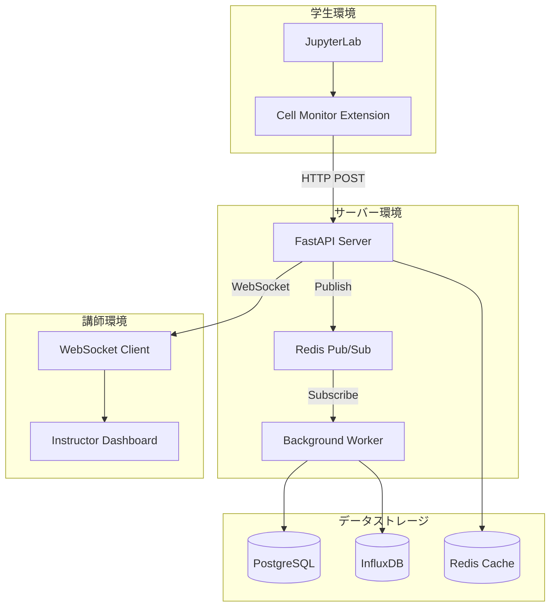
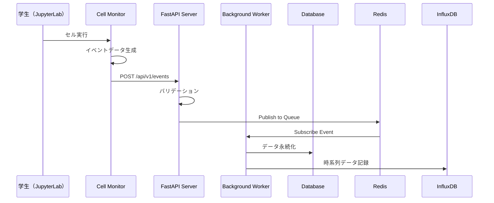
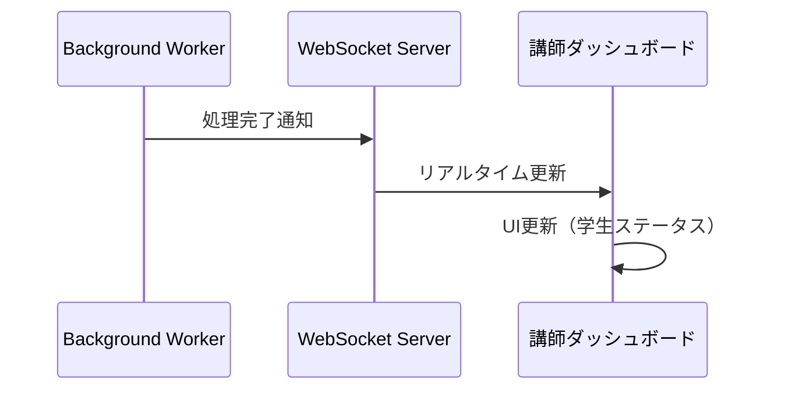

# システム概要

## 🎯 プロジェクトの目的

**JupyterLab Cell Monitor Extension**は、教育現場でのPython学習を支援するリアルタイム学習進捗追跡システムです。学生がJupyterLabでコードを実行する度に、その情報を収集・分析し、講師が学習状況を即座に把握できるようにします。

## 👥 対象ユーザー

### 学生（Primary User）
- **年齢層**: 中学生〜大学生、社会人学習者
- **技術レベル**: プログラミング初心者〜中級者
- **使用環境**: JupyterLab（Webブラウザ）
- **主な操作**: ノートブックでのコード記述・実行

### 講師（Instructor）
- **役割**: 授業進行、学習支援、評価
- **技術レベル**: プログラミング中級者以上
- **使用環境**: Webダッシュボード
- **主な操作**: リアルタイム監視、学習分析、指導介入

### 管理者（Administrator）
- **役割**: システム運用、設定管理
- **技術レベル**: システム管理者
- **使用環境**: サーバー管理画面
- **主な操作**: ユーザー管理、システム設定

## 🏗️ システムアーキテクチャ

### 全体構成図



### 技術スタック

#### フロントエンド
- **JupyterLab Extension**: TypeScript, Lumino Framework
- **Instructor Dashboard**: React, WebSocket API

#### バックエンド
- **FastAPI**: Python 3.11+, Pydantic, SQLAlchemy
- **Background Worker**: Redis Pub/Sub, 非同期処理

#### データベース
- **PostgreSQL**: ユーザー、ノートブック、セル実行履歴
- **InfluxDB**: 時系列の学習データ（実行時間、エラー率など）
- **Redis**: セッション管理、リアルタイム通信

#### インフラ
- **Docker Compose**: 開発環境
- **WebSocket**: リアルタイム通信
- **JWT認証**: セキュアなAPI アクセス

## 📊 主要機能

### 1. リアルタイム学習追跡
**目的**: 学生のコード実行状況を即座に把握

**機能詳細**:
- セル実行の自動検知・記録
- 実行時間、エラー発生、結果の追跡
- ノートブック保存状況の監視

**データ例**:
```json
{
  "eventType": "cell_executed",
  "userId": "student_001",
  "notebookPath": "/assignments/python_basic.ipynb",
  "cellId": "cell_001",
  "executionTime": 150,
  "hasError": false,
  "timestamp": "2024-01-15T14:30:00Z"
}
```

### 2. 講師用ダッシュボード
**目的**: 講師が学習状況を一覧で監視

**表示内容**:
- **学生一覧**: リアルタイムアクティビティステータス
- **進捗マップ**: ノートブック別の進行状況
- **エラー検知**: つまずいている学生の即座の特定
- **統計情報**: クラス全体の学習傾向

**画面イメージ**:
```
┌─────────────────────────────────────────────┐
│ 📊 Class Dashboard - Python基礎講座         │
├─────────────────────────────────────────────┤
│ 🟢 Active: 23 students                     │
│ 🟡 Warning: 3 students (stuck >5min)       │
│ 🔴 Error: 1 student                        │
├─────────────────────────────────────────────┤
│ Student          | Progress | Last Activity │
│ 田中太郎 🟢      | 85%      | Just now     │
│ 佐藤花子 🟡      | 65%      | 3 min ago    │
│ 山田次郎 🔴      | 45%      | 8 min ago    │
└─────────────────────────────────────────────┘
```

### 3. 学習分析・レポート機能
**目的**: 学習パターンの分析と改善提案

**分析項目**:
- **実行パターン**: よく実行されるセル、実行順序
- **エラー傾向**: 頻出エラーとその原因
- **学習速度**: 課題完了時間の分布
- **つまずきポイント**: 長時間停滞するセル

### 4. オフライン対応
**目的**: ネットワーク断絶時のデータ損失防止

**機能**:
- ローカルキューイング（IndexedDB）
- ネットワーク復旧時の自動同期
- データ重複除去

## 🔄 データフロー詳細

### 1. イベント収集フロー


### 2. リアルタイム通知フロー


## 🛡️ セキュリティ・プライバシー

### データ保護
- **個人情報の最小化**: 学習に必要な最小限のデータのみ収集
- **データ匿名化**: 分析時は個人特定情報を除外
- **アクセス制御**: JWT認証による適切な権限管理

### セキュリティ対策
- **HTTPS通信**: すべての通信を暗号化
- **入力検証**: SQLインジェクション、XSS対策
- **レート制限**: DoS攻撃対策

### 教育利用配慮
- **学習データの教育目的利用**: 成績向上・指導改善のみに使用
- **学生の同意**: データ収集について透明性を確保
- **データ保持期間**: 授業期間終了後の適切なデータ削除

## 📈 パフォーマンス要件

### レスポンス時間
- **イベント受信**: 100ms以内
- **ダッシュボード更新**: 1秒以内
- **データ分析**: 5秒以内

### スケーラビリティ
- **同時接続学生**: 100名まで対応
- **イベント処理**: 1,000イベント/分
- **データベース**: 1年間のデータ保持

### 可用性
- **システム稼働率**: 99.5%（授業時間内）
- **データ損失**: 許容度 0.1%未満

## 🔧 運用・保守

### 監視項目
- システムレスポンス時間
- エラー発生率
- データベース使用量
- 同時接続数

### バックアップ
- **PostgreSQL**: 日次フルバックアップ
- **InfluxDB**: 週次バックアップ
- **設定ファイル**: Git管理

### 更新・デプロイ
- **Rolling Update**: サービス無停止更新
- **Feature Toggle**: 段階的機能リリース
- **Rollback**: 問題発生時の即座復旧

## 🚀 将来拡張計画

### Phase 2: 高度分析機能
- AI による学習パターン分析
- 自動的な学習提案機能
- 個別指導支援機能

### Phase 3: 統合学習環境
- 他のLMS（Learning Management System）との連携
- ビデオ通話機能統合
- 協調学習支援機能

### Phase 4: マルチ言語対応
- R、Julia、Scala等への対応拡大
- 多言語UI対応
- グローバル展開対応

## 📚 関連ドキュメント

- **[実装計画](../implementation-plans/)**: 開発者向け詳細実装手順
- **[実装状況](../implementation-status/)**: 現在の開発状況と問題点
- **[API仕様書](../api/)**: システム間連携仕様
- **[ユーザーガイド](../user-guide/)**: エンドユーザー向け操作手順

---

**このシステム概要は、プロジェクト進行に応じて継続的に更新されます。**
