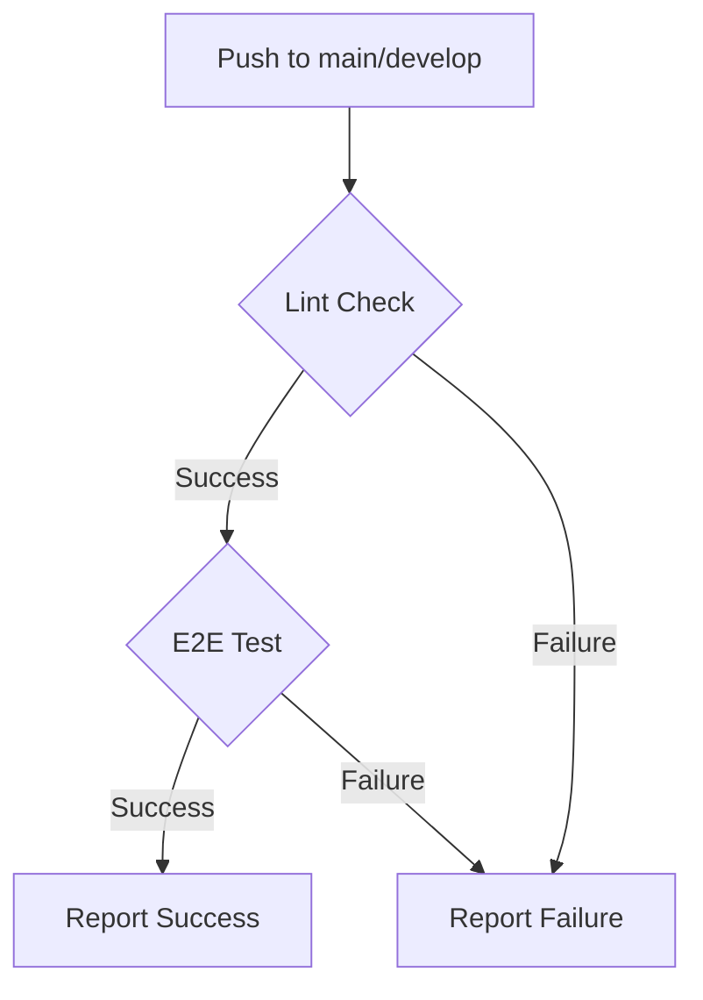

# E2Eテスト戦略

## 1. 目的

このE2E（エンドツーエンド）テストは、JupyterLab拡張機能からFastAPIバックエンドまで、システム全体のデータフローが正しく機能することを保証するために不可欠です。ユーザーの操作を模倣することで、コンポーネント間の連携に起因する問題を検出し、システムの信頼性を高めます。

## 2. テストアーキテクチャ

現在のE2Eテストは、保守性と拡張性を高めるために、Page Object Model (POM) の設計思想に基づいた構造化されたアプローチを採用しています。各コンポーネントは明確な責務を担っています。

- **実行環境:** `Docker Compose`
- **ブラウザ自動化:** `Playwright`

### 構造

- `fastapi_server/tests/e2e/`
  - `test_main_flow.py`: テスト全体の流れを制御するメインのテストランナー。
  - `e2e_config.py`: URL、タイムアウト値、UIセレクターなどの設定情報を一元管理。
  - `jupyter_ui.py`: Playwrightを使ったJupyterLabのUI操作をカプセル化 (`JupyterLabPage` クラス)。
  - `api_client.py`: FastAPIサーバーとのAPI通信を担うクライアント (`FastAPIClient` クラス)。

この設計により、UIの変更は `jupyter_ui.py`、API仕様の変更は `api_client.py` の修正に限定され、テストシナリオ (`test_main_flow.py`) の可読性を高く保ちます。

## 3. テストシナリオ

E2Eテストは以下の主要なシナリオをカバーしています。

1.  **環境起動:** JupyterLabとFastAPIサービスが正常に起動することを確認します。
2.  **ノートブック操作:** `JupyterLabPage`がJupyterLabにアクセスし、新しいノートブックを作成します。
3.  **セル実行:** テストIDを含む一意のコードをセルに入力し、実行します。
4.  **プロキシ経由の転送:** Jupyterサーバーのプロキシハンドラーがイベントを捕捉し、FastAPIのテスト用エンドポイントに転送します。
5.  **イベント受信検証:** `FastAPIClient`がAPIをポーリングし、イベントが正しく受信されたことを検証します。

## 4. 実行方法

### 手動実行

開発環境でE2Eテストを手動で実行するには、以下のコマンドを使用します。

```bash
# 1. Dockerコンテナを起動
docker compose up -d

# 2. リファクタリングされたE2Eテストをモジュールとして実行
# (fastapi_server ディレクトリから実行)
python -m tests.e2e.test_main_flow
```

### CI/CDによる自動実行

このリポジトリでは、GitHub Actionsを使用してCI/CDパイプラインが構築されています。`main`または`develop`ブランチにコードがプッシュされると、以下のワークフローが自動的に実行されます。

- **ファイルパス:** `.github/workflows/e2e-test.yml`

#### CIパイプラインの流れ



1.  **Lint Check**: `black` (フォーマット) と `flake8` (スタイル) を使用して、コード品質を最初に検証します。
2.  **E2E Test**: Lintチェックをパスしたコードのみが、Docker環境でのE2Eテストに進みます。

この二段階のプロセスにより、品質基準を満たしたコードのみがシステム全体のテストに進むため、パイプラインの効率性と信頼性が向上しています。
